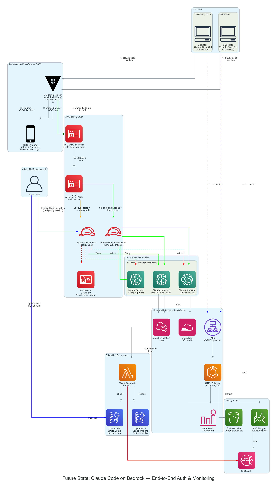

# Enterprise AI Coding Assistant Migration Guide
## Claude Code → Amazon Bedrock with Persona-Based Access Control & Cost Governance

**Document Version:** 1.0  
**Date:** June 12, 2026  
**Classification:** Customer-Facing Technical Guide  
**AWS Solutions Architect:** [Your Name]

---

## Executive Summary

This document provides a comprehensive technical guide for migrating your Claude Code deployment from OIDC Teleport-based authentication to Amazon Bedrock with IAM role-based access control. It builds upon the official **[Guidance for Claude Code and Cowork on Amazon Bedrock](https://github.com/aws-solutions-library-samples/guidance-for-claude-code-with-amazon-bedrock)** (v2.4.0) — the AWS-published reference architecture for enterprise Claude Code deployments — and extends it with per-user token enforcement and persona-based cost governance.

The solution delivers:

- **Per-team model access control** — Engineering gets all Claude models; Sales is restricted to cost-effective models only
- **Per-user token tracking** — Daily and monthly usage visibility at the individual level
- **Dynamic limit management** — Adjust token caps and model access without redeployment
- **Budget forecasting** — Predictive cost modeling based on actual consumption patterns
- **AI-DLC methodology** — Structured delivery using AWS's AI-Driven Development Lifecycle
- **Automated auth & packaging** — Using the `ccwb` CLI from the official guidance for credential helper builds and OIDC federation

> **Official AWS Guidance Repo:** https://github.com/aws-solutions-library-samples/guidance-for-claude-code-with-amazon-bedrock  
> **AWS Solutions Page:** https://aws.amazon.com/solutions/guidance/claude-code-with-amazon-bedrock/  
> **Deployment Blog:** https://aws.amazon.com/blogs/machine-learning/claude-code-deployment-patterns-and-best-practices-with-amazon-bedrock/

---

## Table of Contents

1. [Relationship to Official AWS Guidance](#1-relationship-to-official-aws-guidance)
2. [Architecture Overview](#2-architecture-overview)
3. [AI-DLC Methodology](#3-ai-dlc-methodology)
4. [Migration Runbook](#4-migration-runbook)
5. [Usage Monitoring & Cost Control](#5-usage-monitoring--cost-control)
6. [Dynamic Administration](#6-dynamic-administration)
7. [References & Resources](#7-references--resources)

---

## 1. Relationship to Official AWS Guidance

### The Official Repo

This migration guide is designed to work **alongside** the official AWS-published guidance:

> **[aws-solutions-library-samples/guidance-for-claude-code-with-amazon-bedrock](https://github.com/aws-solutions-library-samples/guidance-for-claude-code-with-amazon-bedrock)**  
> v2.4.0 (Released June 10, 2026) · 333 stars · MIT-0 License · Python/Go

The official guidance provides:
- **`ccwb` CLI** — Automated deployment wizard for OIDC federation, IAM roles, and platform-specific credential helper builds
- **Multi-IdP support** — Okta, Azure AD (Entra ID), Auth0, Google, Cognito User Pools, PingFederate, Keycloak, and Generic OIDC
- **Claude Cowork (Desktop)** — Same deployment covers both Claude Code CLI and Claude Desktop
- **OpenTelemetry monitoring** — Central collector (ECS Fargate) or sidecar (local) for token economics, code activity metrics, and productivity signals
- **Cross-platform packages** — Windows, macOS (ARM + Intel), Linux builds with PyInstaller/Nuitka
- **AWS GovCloud support** — Single codebase for commercial and GovCloud partitions

### What This Document Adds (Beyond the Official Guidance)

The official guidance provides **observability** but not **enforcement**. This document extends it with:

| Capability | Official Guidance | This Document |
|-----------|-------------------|---------------|
| OIDC → IAM federation | ✅ `ccwb deploy` | ✅ Uses `ccwb` + manual fallback |
| Credential helper build | ✅ `ccwb build` | ✅ References `ccwb build` |
| Per-team model restrictions (Allow/Deny) | ⚠️ Single role only | ✅ Multi-role with explicit Deny + Permission Boundary |
| Per-user token cap enforcement | ❌ Not implemented | ✅ Lambda + DynamoDB guardrail |
| Dynamic token limit changes | ❌ Not implemented | ✅ DynamoDB config (no redeployment) |
| Dynamic model enable/disable | ❌ Not implemented | ✅ IAM policy versioning (no redeployment) |
| Budget forecasting & alerts | ⚠️ Observability only | ✅ AWS Budgets + SNS + forecasted thresholds |
| AI-DLC delivery methodology | ❌ Not covered | ✅ Full Inception/Construction/Operation framework |
| Anomaly detection playbooks | ❌ Not covered | ✅ AI-driven operational recommendations |

### Recommended Deployment Path

```
┌─────────────────────────────────────────────────────────────────────┐
│  Step 1: Use the Official Guidance (`ccwb`)                         │
│  ─────────────────────────────────────────                          │
│  • poetry run ccwb init     → Configure IdP (Teleport as Generic   │
│                                OIDC), model, region, monitoring     │
│  • poetry run ccwb deploy   → Deploy IAM OIDC Provider + roles     │
│  • poetry run ccwb build    → Build credential helper packages     │
│  • poetry run ccwb deploy monitoring → Deploy OTEL stack           │
│                                                                     │
│  Step 2: Layer This Guide's Extensions                              │
│  ─────────────────────────────────────                              │
│  • Create SECOND IAM role (Sales) with Deny policy                 │
│  • Deploy Lambda token guardrail + DynamoDB                        │
│  • Configure Application Inference Profiles                         │
│  • Deploy AWS Budgets + SNS alerts                                  │
│  • Distribute team-specific Claude Code configs                     │
│                                                                     │
│  Step 3: Operate with AI-DLC                                        │
│  ────────────────────────────                                       │
│  • Monitor via OTEL dashboard + custom CloudWatch queries          │
│  • Enforce via Lambda guardrail + DynamoDB limits                  │
│  • Adjust via policy versioning + DynamoDB config changes          │
└─────────────────────────────────────────────────────────────────────┘
```

### Using `ccwb` with Teleport as Your OIDC Provider

During `ccwb init`, select **"Generic OIDC"** and provide:

| Parameter | Value |
|-----------|-------|
| OIDC Issuer URL | `https://teleport.yourcompany.com` |
| Client ID | Your Teleport OIDC application client ID |
| Redirect URI | `http://localhost:8400/callback` |
| Scopes | `openid profile email` |
| Subject claim pattern | `engineering-*` or `sales-*` (configure per-role) |

> **Important:** Ensure your Teleport OIDC application registration includes `http://localhost:8400/callback` as an allowed redirect URI. This is required by the credential helper for the browser-based SSO flow.

The `ccwb deploy` command will create the IAM OIDC Provider and a single federated role. For your multi-persona requirement (Engineering vs Sales), you'll then:
1. Use the `ccwb`-deployed role as the Engineering role (full access)
2. Create a second role (Sales) with the restricted policy from this guide
3. Build two sets of credential helper packages pointing to different roles

See [Generic OIDC Setup Guide](https://github.com/aws-solutions-library-samples/guidance-for-claude-code-with-amazon-bedrock/blob/main/assets/docs/providers/generic-oidc-setup.md) for detailed Teleport configuration steps.

### Authentication Modes (from Official Guidance)

| Mode | `ccwb init` Choice | Quota Enforcement | Best For |
|------|-------------------|-------------------|----------|
| **External IdP (OIDC)** ← Your case | `OIDC / Direct IdP` | ✅ Full | Orgs with existing enterprise IdP |
| AWS IAM Identity Center | `AWS IAM Identity Center` | ❌ Not available | Orgs on native AWS identity |
| None | `None` | ❌ Not available | Analytics-only deployments |

You're using **External IdP (OIDC)** mode with Teleport — this gives you full quota enforcement capability, which your Lambda guardrail leverages.

---

## 2. Architecture Overview

### Final-State Architecture Diagram



### Architecture Components

| Layer | Component | Purpose |
|-------|-----------|---------|
| **Identity** | IAM OIDC Provider | Maps Teleport identities to AWS IAM principals |
| **Access Control** | IAM Roles (Engineering/Sales) | Persona-based model access with trust conditions |
| **Compute** | Amazon Bedrock Runtime | Foundation model inference (Claude Sonnet 4, Haiku 4.5, Opus 4) |
| **Guardrails** | Permission Boundaries | Defense-in-depth preventing privilege escalation |
| **Observability** | Model Invocation Logging | Per-request token counts with caller identity |
| **Audit** | AWS CloudTrail | API-level audit trail for compliance |
| **Enforcement** | Lambda + DynamoDB | Real-time token cap tracking and limit enforcement |
| **Alerting** | SNS + AWS Budgets | Threshold-based notifications (50%/80%/100%) |
| **Visualization** | CloudWatch Dashboard | Real-time usage metrics and top-user leaderboard |
| **Cost Attribution** | Application Inference Profiles | Tag-based cost allocation per team/project |

### Data Flow

```
User (Claude Code) → STS AssumeRoleWithWebIdentity → IAM Role
    → Bedrock InvokeModel → Response
    → Model Invocation Log (CloudWatch Logs)
        → Subscription Filter → Lambda Guardrail
            → DynamoDB (token counter increment)
            → SNS Alert (if limit exceeded)
    → CloudTrail (API audit record)
    → Cost & Usage Report (cost allocation tags)
```

### Key Design Decisions

| Decision | Rationale |
|----------|-----------|
| Explicit Deny for Sales on Sonnet/Opus | IAM Deny always wins — even if someone grants broader access later |
| Permission Boundary on Sales Role | Defense-in-depth — boundary caps maximum possible permissions |
| DynamoDB for limits (not Service Quotas) | Enables per-user granularity and instant changes without AWS support tickets |
| Asynchronous Lambda guardrail | Zero latency impact on model invocations — processes logs after-the-fact |
| Application Inference Profiles | Native AWS cost attribution per team without custom proxy infrastructure |

---

## 3. AI-DLC Methodology

This migration is delivered using the **AI-Driven Development Lifecycle (AI-DLC)** framework — an AWS methodology that repositions AI from coding assistant to development orchestrator while maintaining human oversight at every decision point.

> *"AI-DLC breaks traditional SDLC into three phases: Inception, Construction, and Operations. Each phase leverages AI capabilities while maintaining human oversight and strategic control."*
>
> — [AI-Driven Development Life Cycle: Reimagining Software Engineering](https://aws.amazon.com/blogs/devops/ai-driven-development-life-cycle/)

### What is AI-DLC?

AI-DLC is a structured, governance-rich methodology that:
- Positions AI as a **central collaborator** in the development process
- Embeds **controls and oversight** at every stage
- Uses **Bolts** (replacing traditional sprints) as delivery units
- Requires **human approval** at each phase gate
- Maintains a **documentation-first** approach for compliance and audit

### AI-DLC for Financial Services & Regulated Industries

For organizations with operational risk concerns, AI-DLC directly addresses governance requirements:
- Structured human-in-the-loop approval gates
- Audit trail of all AI-generated decisions
- Compliance documentation generated as a byproduct of delivery
- Risk assessment embedded in each phase transition

> Reference: [AI-Driven Development Lifecycle for Financial Services](https://aws.amazon.com/blogs/industries/ai-driven-development-lifecycle-for-financial-services/)

---

### Phase 1: Inception — Intent Capture & Work Breakdown

**Purpose:** Capture intents and translate them into development-ready units.

**Core Ritual: Mob Elaboration** — AI proposes initial breakdowns; the team refines them collaboratively. This is not a brainstorming session — it's a structured protocol where AI generates the first draft and humans apply judgment.

```
┌──────────────────────┐     ┌────────────────────────┐     ┌────────────────────────┐
│  AI proposes initial  │────▶│  Team reviews &         │────▶│  Refined units ready    │
│  breakdown (policies, │     │  challenges assumptions │     │  for Construction       │
│  architecture, tests) │     │  (security, cost, UX)   │     │  (with acceptance       │
│                       │     │                         │     │   criteria)             │
└──────────────────────┘     └────────────────────────┘     └────────────────────────┘
```

**Activities for This Migration:**

| Activity | Owner | Output | AI Role |
|----------|-------|--------|---------|
| Define personas (Engineering, Sales) | Team Lead | Persona matrix with model entitlements | AI proposes initial persona/model mapping based on cost profiles |
| IAM policy breakdown | Security + AI | Draft policy JSONs | AI generates policy documents; team validates trust conditions |
| Mob Elaboration session | Full team | Refined policies, agreed token limits | AI presents options; team decides limits |
| Map OIDC claims → roles | Engineering + Security | Claim → Role mapping | AI proposes condition syntax; team validates with existing Teleport config |
| Monitoring requirements | Team Lead + Finance | Dashboard specs, thresholds | AI proposes budget model based on pricing × expected usage |
| Acceptance criteria | Team Lead | Verification checklist | AI drafts; team approves |

**Development Units Produced:**

| Unit ID | Description | Estimated Effort |
|---------|-------------|-----------------|
| `UNIT-IAM-001` | OIDC Provider configuration | 2h |
| `UNIT-IAM-002` | Engineering role + trust policy | 2h |
| `UNIT-IAM-003` | Sales role + trust policy + permission boundary | 3h |
| `UNIT-IAM-004` | Engineering Bedrock access policy | 1h |
| `UNIT-IAM-005` | Sales Bedrock restricted policy (Allow + Deny) | 2h |
| `UNIT-MON-001` | Model invocation logging setup | 3h |
| `UNIT-MON-002` | CloudTrail audit configuration | 1h |
| `UNIT-MON-003` | CloudWatch dashboard | 2h |
| `UNIT-MON-004` | Lambda token guardrail + DynamoDB | 4h |
| `UNIT-MON-005` | AWS Budgets + SNS alerts | 1h |
| `UNIT-INF-001` | Application Inference Profiles (cost tags) | 2h |
| `UNIT-CUT-001` | Phased cutover plan | 2h |
| `UNIT-CUT-002` | Rollback procedures | 1h |

---

### Phase 2: Construction — Iterative Execution

**Purpose:** Transform units into tested, deployment-ready artifacts.

**Progression:** Domain Design → Logical Design → Code Generation → Automated Testing

| Stage | Activities | Artifacts |
|-------|-----------|-----------|
| **Domain Design** | Map personas to IAM constructs; define token economics model (Sonnet 4: $3/$15 per M tokens; Haiku: $0.25/$1.25 per M tokens) | Domain model, cost projection spreadsheet |
| **Logical Design** | Design IAM policy evaluation chain (Allow + Deny + Boundary); design Lambda → DynamoDB data flow; design inference profile → CUR tag flow | Architecture Decision Records (ADRs) |
| **Code Generation** | AI generates IAM policies, Terraform modules, Lambda code, dashboard JSON, CloudFormation templates | IaC in `terraform/`, Lambda in `src/`, configs in `configs/` |
| **Automated Testing** | Policy simulator validation, integration tests against Bedrock sandbox, load test token tracking Lambda | Test results, validated policy simulator output |

**Iteration Cadence (3-Week Bolt):**

```
Week 1: IAM Foundation (UNIT-IAM-001 through UNIT-IAM-005)
├── Day 1-2: Domain + Logical design (AI drafts, team reviews)
├── Day 3-4: Code generation (AI generates IaC) + policy simulator tests
└── Day 5: Integration test with test identities (human validates)

Week 2: Monitoring Stack (UNIT-MON-001 through UNIT-MON-005 + UNIT-INF-001)
├── Day 1-2: Logging + CloudTrail + Inference Profiles
├── Day 3-4: Lambda guardrail + dashboard (AI generates, team reviews)
└── Day 5: End-to-end validation (human signs off)

Week 3: Cutover (UNIT-CUT-001 + UNIT-CUT-002)
├── Day 1-2: Canary users (1 engineer + 1 sales)
├── Day 3: Full engineering team migration
├── Day 4: Full sales team migration
└── Day 5: Teleport decommission + monitoring soak
```

**Testing Gates (each unit must pass before merge):**

- [ ] `aws iam simulate-custom-policy` confirms expected Allow/Deny for each persona
- [ ] Integration test: real `bedrock:InvokeModel` call succeeds for Engineering on Sonnet 4
- [ ] Integration test: real `bedrock:InvokeModel` call returns `AccessDeniedException` for Sales on Sonnet 4
- [ ] Integration test: real `bedrock:InvokeModel` call succeeds for Sales on Haiku
- [ ] Token tracking: DynamoDB counter increments correctly per invocation
- [ ] Alert: SNS notification fires when DynamoDB counter exceeds configured limit
- [ ] Dashboard: CloudWatch dashboard renders correct widgets with live data
- [ ] Cost allocation: CUR shows tags from inference profiles within 24h

---

### Phase 3: Operation — Deploy, Observe, Maintain

**Purpose:** Deployment, observability, and ongoing maintenance with AI-driven anomaly detection.

| Activity | Trigger | AI Role |
|----------|---------|---------|
| **Deployment** | Merge to `main` | AI validates Terraform plan, flags destructive changes |
| **Anomaly detection** | Continuous (every 5min) | AI analyses CloudWatch metrics — flags unusual spikes, unexpected model calls |
| **Drift detection** | Daily | AI compares deployed IAM policies to IaC source — alerts on manual console changes |
| **Capacity recommendations** | Weekly | AI analyses usage patterns, proposes token limit adjustments with cost impact |
| **Model access proposals** | On new Bedrock model release | AI proposes which persona should get access based on cost/capability profile |
| **Incident response** | Alert fired | AI provides root-cause analysis from logs + recommended remediation |

**AI-Driven Telemetry Analysis:**

```
┌────────────────────┐     ┌──────────────────────┐     ┌─────────────────────────┐
│ CloudWatch Logs    │────▶│ AI Anomaly           │────▶│ Actionable              │
│ + CloudTrail       │     │ Detection Engine     │     │ Recommendations         │
│ + CUR 2.0         │     │ (pattern matching,   │     │ (Slack/Email/PagerDuty) │
│                    │     │  trend forecasting)  │     │                         │
└────────────────────┘     └──────────────────────┘     └─────────────────────────┘
```

**Operational Playbook Examples:**

| Signal | AI Recommendation |
|--------|------------------|
| Sales user hitting token limit daily | *"Consider raising daily limit from 500K → 750K based on 7-day trend; projected monthly cost increase: $12"* |
| Engineering usage spiked 3x overnight | *"Anomaly: user X consumed 15M tokens in 2h (vs 2M avg). Likely batch job. Confirm intentional or throttle."* |
| New model `anthropic.claude-4-opus` released | *"New model detected. Cost: $15/M input. Recommend: Enable for Engineering (matches capability needs), Deny for Sales (exceeds budget profile). IAM policy version update attached."* |
| Policy drift detected | *"WARNING: Sales role policy modified via console at 14:32 UTC. Change added Sonnet access. Recommend: revert to IaC version and re-apply Terraform."* |
| Monthly budget at 80% with 10 days remaining | *"Forecast: $4,200 of $5,000 budget consumed. Projected overage: $800. Options: (1) reduce engineering daily cap by 20%, (2) request budget increase, (3) no action."* |

---

## 4. Migration Runbook

### Deployment Option A: Using `ccwb` CLI (Recommended)

The fastest path uses the official [Guidance for Claude Code with Amazon Bedrock](https://github.com/aws-solutions-library-samples/guidance-for-claude-code-with-amazon-bedrock) deployment CLI:

```bash
# Clone the official guidance repo
git clone https://github.com/aws-solutions-library-samples/guidance-for-claude-code-with-amazon-bedrock.git
cd guidance-for-claude-code-with-amazon-bedrock

# Install dependencies
poetry install

# Initialize — select "Generic OIDC" for Teleport
poetry run ccwb init
# → Authentication: Generic OIDC
# → Issuer URL: https://teleport.yourcompany.com
# → Client ID: <your-teleport-oidc-client-id>
# → Model: Claude Sonnet 4 (Engineering) or Claude Haiku 4.5 (Sales)
# → Cross-Region Profile: US
# → Monitoring: Central collector (ECS Fargate)

# Deploy IAM OIDC Provider + federated role + monitoring
poetry run ccwb deploy
poetry run ccwb deploy monitoring

# Build platform-specific credential helpers
poetry run ccwb build

# (Optional) Extend to Claude Desktop
poetry run ccwb cowork generate
```

After `ccwb deploy`, you have a working Engineering role. Then layer the Sales role and token enforcement from this guide (Steps 2-6 below).

### Deployment Option B: Manual (Advanced)

Use when you need full control over the IAM resources or cannot use Poetry/Python in your environment.

### Prerequisites

```bash
# Verify AWS CLI version (requires 2.15+)
aws --version

# Confirm Bedrock access in your region
aws bedrock list-foundation-models --region us-east-1 \
  --query "modelSummaries[?contains(modelId, 'anthropic')].modelId" \
  --output table

# Set environment variables
export AWS_ACCOUNT_ID=$(aws sts get-caller-identity --query Account --output text)
export AWS_REGION="us-east-1"
```

### Step 1: Create IAM OIDC Identity Provider

Map your Teleport cluster as a trusted identity provider in IAM:

```bash
TELEPORT_ISSUER="https://teleport.yourcompany.com"

# Get the OIDC thumbprint
THUMBPRINT=$(openssl s_client -connect teleport.yourcompany.com:443 \
  -servername teleport.yourcompany.com </dev/null 2>/dev/null | \
  openssl x509 -fingerprint -sha1 -noout | \
  sed 's/://g' | cut -d= -f2 | tr '[:upper:]' '[:lower:]')

# Create the provider
aws iam create-open-id-connect-provider \
  --url "${TELEPORT_ISSUER}" \
  --client-id-list "aws-bedrock-access" \
  --thumbprint-list "${THUMBPRINT}"
```

### Step 2: Create Persona-Based IAM Roles

#### Engineering Role (Full Claude Access)

```json
// engineering-trust-policy.json
{
  "Version": "2012-10-17",
  "Statement": [{
    "Effect": "Allow",
    "Principal": {
      "Federated": "arn:aws:iam::ACCOUNT_ID:oidc-provider/teleport.yourcompany.com"
    },
    "Action": "sts:AssumeRoleWithWebIdentity",
    "Condition": {
      "StringEquals": {
        "teleport.yourcompany.com:aud": "aws-bedrock-access"
      },
      "StringLike": {
        "teleport.yourcompany.com:sub": "engineering-*"
      }
    }
  }]
}
```

```bash
aws iam create-role \
  --role-name BedrockEngineeringRole \
  --assume-role-policy-document file://engineering-trust-policy.json \
  --tags Key=Team,Value=Engineering Key=CostCenter,Value=AI-Engineering
```

#### Sales Role (Restricted Access)

```json
// sales-trust-policy.json
{
  "Version": "2012-10-17",
  "Statement": [{
    "Effect": "Allow",
    "Principal": {
      "Federated": "arn:aws:iam::ACCOUNT_ID:oidc-provider/teleport.yourcompany.com"
    },
    "Action": "sts:AssumeRoleWithWebIdentity",
    "Condition": {
      "StringEquals": {
        "teleport.yourcompany.com:aud": "aws-bedrock-access"
      },
      "StringLike": {
        "teleport.yourcompany.com:sub": "sales-*"
      }
    }
  }]
}
```

```bash
aws iam create-role \
  --role-name BedrockSalesRole \
  --assume-role-policy-document file://sales-trust-policy.json \
  --tags Key=Team,Value=Sales Key=CostCenter,Value=AI-Sales
```

### Step 3: Create IAM Policies

#### Engineering Policy — All Claude Models (Current + Future)

```json
{
  "Version": "2012-10-17",
  "Statement": [
    {
      "Sid": "AllowAllClaudeModels",
      "Effect": "Allow",
      "Action": [
        "bedrock:InvokeModel",
        "bedrock:InvokeModelWithResponseStream",
        "bedrock:Converse",
        "bedrock:ConverseStream"
      ],
      "Resource": "arn:aws:bedrock:*::foundation-model/anthropic.*"
    },
    {
      "Sid": "AllowListAndDiscover",
      "Effect": "Allow",
      "Action": [
        "bedrock:ListFoundationModels",
        "bedrock:ListInferenceProfiles",
        "bedrock:GetFoundationModel",
        "bedrock:GetInferenceProfile"
      ],
      "Resource": "*"
    }
  ]
}
```

> **Note:** The `anthropic.*` wildcard ensures future Claude models are automatically accessible — no policy updates needed when Anthropic releases new versions.

#### Sales Policy — Haiku Only + Explicit Deny on Expensive Models

```json
{
  "Version": "2012-10-17",
  "Statement": [
    {
      "Sid": "AllowHaikuOnly",
      "Effect": "Allow",
      "Action": ["bedrock:InvokeModel", "bedrock:InvokeModelWithResponseStream",
                 "bedrock:Converse", "bedrock:ConverseStream"],
      "Resource": [
        "arn:aws:bedrock:*::foundation-model/anthropic.claude-3-haiku-*",
        "arn:aws:bedrock:*::foundation-model/anthropic.claude-haiku-4-5-*"
      ]
    },
    {
      "Sid": "AllowCrossRegionInference",
      "Effect": "Allow",
      "Action": ["bedrock:InvokeModel", "bedrock:InvokeModelWithResponseStream",
                 "bedrock:Converse", "bedrock:ConverseStream"],
      "Resource": "arn:aws:bedrock:*:ACCOUNT_ID:inference-profile/anthropic.claude-*-haiku-*"
    },
    {
      "Sid": "DenyExpensiveModels",
      "Effect": "Deny",
      "Action": ["bedrock:InvokeModel", "bedrock:InvokeModelWithResponseStream",
                 "bedrock:Converse", "bedrock:ConverseStream"],
      "Resource": [
        "arn:aws:bedrock:*::foundation-model/anthropic.claude-sonnet-*",
        "arn:aws:bedrock:*::foundation-model/anthropic.claude-opus-*"
      ]
    },
    {
      "Sid": "AllowListModels",
      "Effect": "Allow",
      "Action": ["bedrock:ListFoundationModels", "bedrock:GetFoundationModel"],
      "Resource": "*"
    }
  ]
}
```

> **Why the explicit Deny?** In IAM policy evaluation, an explicit Deny **always** overrides any Allow. This means even if someone accidentally grants broader access to the Sales role in the future, the Deny statement blocks Sonnet/Opus access. This is a critical security pattern called "deny-first" defense.

#### Permission Boundary (Defense-in-Depth)

```bash
aws iam put-role-permissions-boundary \
  --role-name BedrockSalesRole \
  --permissions-boundary "arn:aws:iam::ACCOUNT_ID:policy/BedrockSalesPermissionBoundary"
```

### Step 4: Configure Application Inference Profiles (Cost Attribution)

Application Inference Profiles enable per-team cost tracking natively in AWS Cost Explorer without custom proxy infrastructure:

```bash
# Create inference profile for Engineering team
aws bedrock create-inference-profile \
  --inference-profile-name "engineering-claude-sonnet" \
  --model-source '{"copyFrom": "arn:aws:bedrock:us-east-1::foundation-model/anthropic.claude-sonnet-4-20250514-v1:0"}' \
  --tags Key=Team,Value=Engineering Key=CostCenter,Value=CC-1001 Key=Project,Value=AI-CodingAssistant

# Create inference profile for Sales team  
aws bedrock create-inference-profile \
  --inference-profile-name "sales-claude-haiku" \
  --model-source '{"copyFrom": "arn:aws:bedrock:us-east-1::foundation-model/anthropic.claude-haiku-4-5-20250922-v1:0"}' \
  --tags Key=Team,Value=Sales Key=CostCenter,Value=CC-2001 Key=Project,Value=AI-CodingAssistant
```

> **Key benefit:** Tags on inference profiles flow directly to AWS Cost & Usage Report (CUR 2.0) and Cost Explorer, enabling finance teams to see per-team AI spend without custom reporting.

### Step 5: Configure Claude Code Clients

#### Option A: Credential Helper (Recommended — via `ccwb build`)

The `ccwb build` command produces platform-specific executables that handle OIDC token refresh automatically. Users authenticate via browser SSO — no static credentials stored.

```bash
# Distribute the built packages to each team
# Engineering gets packages built with the Engineering role
# Sales gets packages built with the Sales role

# Build output is in dist/ with platform-specific installers:
# - dist/macos-arm64/install.sh
# - dist/macos-x64/install.sh
# - dist/linux-x64/install.sh
# - dist/windows-x64/install.bat
```

The credential helper integrates with the AWS CLI credential_process:
```ini
# ~/.aws/config (automatically configured by install script)
[profile claude-bedrock]
credential_process = /usr/local/bin/ccwb-credential-helper
```

#### Option B: Static Configuration (Fallback)

If credential helper distribution is not feasible:

#### Engineering Team (`~/.claude/settings.json`)

```json
{
  "provider": "bedrock",
  "bedrock": {
    "region": "us-east-1",
    "roleArn": "arn:aws:iam::ACCOUNT_ID:role/BedrockEngineeringRole",
    "model": "anthropic.claude-sonnet-4-20250514-v1:0"
  }
}
```

#### Sales Team (`~/.claude/settings.json`)

```json
{
  "provider": "bedrock",
  "bedrock": {
    "region": "us-east-1",
    "roleArn": "arn:aws:iam::ACCOUNT_ID:role/BedrockSalesRole",
    "model": "anthropic.claude-haiku-4-5-20250922-v1:0"
  }
}
```

### Step 6: Phased Cutover

| Phase | Timeline | Action | Validation |
|-------|----------|--------|-----------|
| **0 - Deploy** | Day -7 | Deploy IAM roles, policies, monitoring | Policy simulator tests pass |
| **1 - Canary** | Day -3 | 1 engineer + 1 sales user on new config | Both can invoke expected models |
| **2 - Logging** | Day -1 | Enable model invocation logging | Verify logs appear in CloudWatch |
| **3 - Engineering** | Day 0 AM | Full engineering team migration | CloudTrail shows new role usage |
| **4 - Sales** | Day 0 PM | Full sales team migration | Sales Deny confirmed in logs |
| **5 - Verify** | Day +1 | Monitor for Teleport-originated calls | Zero calls outside new roles |
| **6 - Decommission** | Day +7 | Disable Teleport → Bedrock integration | Final validation |

---

## 5. Usage Monitoring & Cost Control

### 4.1: Model Invocation Logging

Enable per-request token tracking with caller identity:

```bash
aws bedrock put-model-invocation-logging-configuration \
  --logging-config '{
    "cloudWatchConfig": {
      "logGroupName": "/aws/bedrock/model-invocations",
      "roleArn": "arn:aws:iam::ACCOUNT_ID:role/BedrockInvocationLoggingRole",
      "largeDataDeliveryS3Config": {
        "bucketName": "bedrock-invocation-logs-ACCOUNT_ID-us-east-1",
        "keyPrefix": "large-data"
      }
    },
    "s3Config": {
      "bucketName": "bedrock-invocation-logs-ACCOUNT_ID-us-east-1",
      "keyPrefix": "invocation-logs"
    },
    "textDataDeliveryEnabled": true,
    "imageDataDeliveryEnabled": false,
    "embeddingDataDeliveryEnabled": false
  }'
```

**Log record structure (per invocation):**
```json
{
  "schemaType": "ModelInvocationLog",
  "schemaVersion": "1.0",
  "timestamp": "2026-06-12T14:30:00Z",
  "accountId": "123456789012",
  "identity": {
    "arn": "arn:aws:sts::123456789012:assumed-role/BedrockEngineeringRole/john.doe"
  },
  "region": "us-east-1",
  "requestId": "abc-123",
  "operation": "Converse",
  "modelId": "anthropic.claude-sonnet-4-20250514-v1:0",
  "input": { "inputTokenCount": 1500, "inputContentType": "application/json" },
  "output": { "outputTokenCount": 800, "outputContentType": "application/json" }
}
```

### 4.2: CloudWatch Logs Insights Queries

#### Per-User Daily Token Usage
```sql
fields identity.arn as principal,
       input.inputTokenCount as inTokens,
       output.outputTokenCount as outTokens, modelId
| stats sum(inTokens) as totalInput,
        sum(outTokens) as totalOutput,
        sum(inTokens + outTokens) as totalTokens,
        count() as invocations
        by principal, modelId
| sort totalTokens desc
```

#### Per-Team Aggregation
```sql
fields identity.arn as principal,
       input.inputTokenCount as inTokens,
       output.outputTokenCount as outTokens
| parse principal "assumed-role/*/session" as role
| stats sum(inTokens) as totalInput,
        sum(outTokens) as totalOutput,
        sum(inTokens + outTokens) as totalTokens,
        count() as calls
        by role
| sort totalTokens desc
```

#### Cost Estimation
```sql
fields identity.arn as principal, modelId,
       input.inputTokenCount as inTokens,
       output.outputTokenCount as outTokens
| stats sum(inTokens) as totalIn, sum(outTokens) as totalOut by principal, modelId
-- Post-process: Sonnet 4 = $3/M in + $15/M out; Haiku = $0.25/M in + $1.25/M out
```

### 4.3: Token Limit Enforcement Architecture

```
CloudWatch Logs ──► Subscription Filter ──► Lambda Function
                                                │
                                    ┌───────────┼───────────┐
                                    ▼           ▼           ▼
                              DynamoDB      DynamoDB      SNS
                              (Usage)       (Limits)     (Alerts)
                              +tokens       check cap    notify
```

**DynamoDB Schema:**

| PrincipalId | DateKey | TotalTokens | InputTokens | OutputTokens | InvocationCount |
|-------------|---------|-------------|-------------|--------------|-----------------|
| `john.doe` | `DAILY#2026-06-12` | 45,000 | 30,000 | 15,000 | 12 |
| `john.doe` | `MONTHLY#2026-06` | 890,000 | 600,000 | 290,000 | 245 |
| `LIMITS#BedrockEngineeringRole` | `CONFIG` | - | DailyLimit: 5M | MonthlyLimit: 100M | Enabled: true |
| `LIMITS#BedrockSalesRole` | `CONFIG` | - | DailyLimit: 500K | MonthlyLimit: 10M | Enabled: true |

### 4.4: IAM Principal-Based Cost Allocation (Native)

As of 2026, Amazon Bedrock supports **IAM Principal-Based Cost Allocation** — automatically recording the caller's IAM role in your Cost and Usage Report without any custom infrastructure:

```bash
# Enable principal-based cost allocation in your account
aws ce update-cost-allocation-tags-status \
  --cost-allocation-tags-status TagKey=Team,Status=Active
```

This means you get per-team cost breakdown in AWS Cost Explorer **natively** — the IAM role used to invoke Bedrock appears as a cost dimension.

> Reference: [Track Amazon Bedrock Costs by Caller Identity with IAM Principal-Based Cost Allocation](https://aws.amazon.com/blogs/aws-cloud-financial-management/track-amazon-bedrock-costs-by-caller-identity-with-iam-based-cost-allocation/)

---

## 6. Dynamic Administration

### 5.1: Increase/Decrease Token Limits (No Redeployment)

```bash
# Increase engineering daily limit to 10M tokens
aws dynamodb put-item --table-name BedrockTokenUsage --item '{
  "PrincipalId": {"S": "LIMITS#BedrockEngineeringRole"},
  "DateKey": {"S": "CONFIG"},
  "DailyTokenLimit": {"N": "10000000"},
  "MonthlyTokenLimit": {"N": "200000000"},
  "Enabled": {"BOOL": true}
}'

# Decrease sales daily limit to 200K tokens
aws dynamodb put-item --table-name BedrockTokenUsage --item '{
  "PrincipalId": {"S": "LIMITS#BedrockSalesRole"},
  "DateKey": {"S": "CONFIG"},
  "DailyTokenLimit": {"N": "200000"},
  "MonthlyTokenLimit": {"N": "5000000"},
  "Enabled": {"BOOL": true}
}'
```

**Effect:** Immediate — next Lambda invocation reads new limits.

### 5.2: Enable/Disable Models Per Persona (No Redeployment)

```bash
# Grant Sales access to a new model (e.g., Claude 3.5 Haiku)
# Create a new policy version — takes effect immediately
aws iam create-policy-version \
  --policy-arn "arn:aws:iam::ACCOUNT_ID:policy/BedrockSalesRestrictedAccess" \
  --policy-document file://updated-sales-policy.json \
  --set-as-default
```

**Effect:** Immediate — IAM evaluates the new default policy version on next API call.

### 5.3: Disable a User (Emergency)

```bash
# Option A: Set their daily limit to 0
aws dynamodb put-item --table-name BedrockTokenUsage --item '{
  "PrincipalId": {"S": "LIMITS#BedrockSalesRole"},
  "DateKey": {"S": "CONFIG"},
  "DailyTokenLimit": {"N": "0"},
  "Enabled": {"BOOL": false}
}'

# Option B: Add an inline Deny policy (immediate, surgical)
aws iam put-role-policy \
  --role-name BedrockSalesRole \
  --policy-name EmergencyDeny \
  --policy-document '{"Version":"2012-10-17","Statement":[{"Effect":"Deny","Action":"bedrock:*","Resource":"*"}]}'
```

---

## 7. References & Resources

### AWS Documentation

| Resource | URL |
|----------|-----|
| **Guidance for Claude Code with Amazon Bedrock (Official Repo)** | https://github.com/aws-solutions-library-samples/guidance-for-claude-code-with-amazon-bedrock |
| **AWS Solutions Page** | https://aws.amazon.com/solutions/guidance/claude-code-with-amazon-bedrock/ |
| Quick Start Guide (ccwb deployment) | https://github.com/aws-solutions-library-samples/guidance-for-claude-code-with-amazon-bedrock/blob/main/QUICK_START.md |
| Architecture Guide | https://github.com/aws-solutions-library-samples/guidance-for-claude-code-with-amazon-bedrock/blob/main/assets/docs/ARCHITECTURE.md |
| Monitoring Guide (OTEL) | https://github.com/aws-solutions-library-samples/guidance-for-claude-code-with-amazon-bedrock/blob/main/assets/docs/MONITORING.md |
| Analytics Guide (Athena) | https://github.com/aws-solutions-library-samples/guidance-for-claude-code-with-amazon-bedrock/blob/main/assets/docs/ANALYTICS.md |
| Generic OIDC Provider Setup (for Teleport) | https://github.com/aws-solutions-library-samples/guidance-for-claude-code-with-amazon-bedrock/blob/main/assets/docs/providers/generic-oidc-setup.md |
| CLI Reference (ccwb) | https://github.com/aws-solutions-library-samples/guidance-for-claude-code-with-amazon-bedrock/blob/main/assets/docs/CLI_REFERENCE.md |
| Claude Cowork (Desktop) 3P Guide | https://github.com/aws-solutions-library-samples/guidance-for-claude-code-with-amazon-bedrock/blob/main/assets/docs/COWORK_3P.md |
| Amazon Bedrock IAM Policy Examples | https://docs.aws.amazon.com/bedrock/latest/userguide/security_iam_id-based-policy-examples.html |
| Bedrock Model Invocation Logging | https://docs.aws.amazon.com/bedrock/latest/userguide/model-invocation-logging.html |
| Bedrock CloudTrail Integration | https://docs.aws.amazon.com/bedrock/latest/userguide/logging-using-cloudtrail.html |
| Bedrock CloudWatch Runtime Metrics | https://docs.aws.amazon.com/bedrock/latest/userguide/monitoring-runtime-metrics.html |
| Bedrock Model IDs & ARNs | https://docs.aws.amazon.com/bedrock/latest/userguide/model-ids-arns.html |
| Track Usage and Costs in Bedrock | https://docs.aws.amazon.com/bedrock/latest/userguide/cost-management.html |
| Inference Profiles Setup | https://docs.aws.amazon.com/bedrock/latest/userguide/inference-profiles.html |
| Bedrock Cost Management with Projects | https://docs.aws.amazon.com/bedrock/latest/userguide/cost-mgmt-projects.html |
| IAM OIDC Identity Providers | https://docs.aws.amazon.com/IAM/latest/UserGuide/id_roles_providers_create_oidc.html |
| IAM Permission Boundaries | https://docs.aws.amazon.com/IAM/latest/UserGuide/access_policies_boundaries.html |
| IAM Policy Evaluation Logic | https://docs.aws.amazon.com/IAM/latest/UserGuide/reference_policies_evaluation-logic.html |
| Teleport AWS Integration Guide | https://goteleport.com/docs/enroll-resources/application-access/cloud-apis/aws/ |

### AWS Blog Posts

| Title | URL |
|-------|-----|
| Claude Code Deployment Patterns and Best Practices with Amazon Bedrock | https://aws.amazon.com/blogs/machine-learning/claude-code-deployment-patterns-and-best-practices-with-amazon-bedrock/ |
| Running Claude Cowork in Amazon Bedrock (Desktop) | https://aws.amazon.com/blogs/machine-learning/from-developer-desks-to-the-whole-organization-running-claude-cowork-in-amazon-bedrock/ |
| Simplified Amazon Bedrock Model Access (IAM-based) | https://aws.amazon.com/blogs/security/simplified-amazon-bedrock-model-access |
| Implementing Least Privilege Access for Amazon Bedrock | https://aws.amazon.com/blogs/security/implementing-least-privilege-access-for-amazon-bedrock/ |
| Amazon Bedrock Baseline Architecture in an AWS Landing Zone | https://aws.amazon.com/blogs/architecture/amazon-bedrock-baseline-architecture-in-an-aws-landing-zone |
| Amazon Bedrock Guardrails: IAM Policy-Based Enforcement | https://aws.amazon.com/blogs/machine-learning/amazon-bedrock-guardrails-announces-iam-policy-based-enforcement-to-deliver-safe-ai-interactions/ |
| Track Bedrock Costs by Caller Identity (IAM Principal-Based) | https://aws.amazon.com/blogs/aws-cloud-financial-management/track-amazon-bedrock-costs-by-caller-identity-with-iam-based-cost-allocation/ |
| Introducing Granular Cost Attribution for Amazon Bedrock | https://aws.amazon.com/blogs/machine-learning/introducing-granular-cost-attribution-for-amazon-bedrock/ |
| Cost Tracking Multi-Tenant Model Inference on Amazon Bedrock | https://aws.amazon.com/blogs/machine-learning/cost-tracking-multi-tenant-model-inference-on-amazon-bedrock |
| Manage Multi-Tenant Bedrock Costs Using Application Inference Profiles | https://aws.amazon.com/blogs/machine-learning/manage-multi-tenant-amazon-bedrock-costs-using-application-inference-profiles/ |
| Build a Proactive AI Cost Management System for Bedrock – Part 1 | https://aws.amazon.com/blogs/machine-learning/build-a-proactive-ai-cost-management-system-for-amazon-bedrock-part-1/ |
| Build a Proactive AI Cost Management System for Bedrock – Part 2 | https://aws.amazon.com/blogs/machine-learning/build-a-proactive-ai-cost-management-system-for-amazon-bedrock-part-2/ |
| Configure Fine-Grained Access to Bedrock Models (SageMaker Unified Studio) | https://aws.amazon.com/blogs/machine-learning/configure-fine-grained-access-to-amazon-bedrock-models-using-amazon-sagemaker-unified-studio/ |

### AI-DLC Methodology References

| Title | URL |
|-------|-----|
| AI-Driven Development Life Cycle: Reimagining Software Engineering | https://aws.amazon.com/blogs/devops/ai-driven-development-life-cycle/ |
| Open-Sourcing Adaptive Workflows for AI-DLC | https://aws.amazon.com/blogs/devops/open-sourcing-adaptive-workflows-for-ai-driven-development-life-cycle-ai-dlc/ |
| Building with AI-DLC using Amazon Q Developer | https://aws.amazon.com/blogs/devops/building-with-ai-dlc-using-amazon-q-developer/ |
| AI-DLC for Financial Services | https://aws.amazon.com/blogs/industries/ai-driven-development-lifecycle-for-financial-services/ |
| AI-DLC Adaptive Workflow Rules (GitHub - awslabs) | https://github.com/awslabs/aidlc-workflows |
| AI-DLC Collaborative Documentation | https://aws-samples.github.io/sample-collaborative-ai-dlc/getting-started/methodology/ |

### AWS Solutions & Sample Code

| Resource | URL |
|----------|-----|
| Guidance for Tracking & Managing Costs on Amazon Bedrock (AWS Solutions) | https://aws.amazon.com/solutions/guidance/tracking-and-managing-costs-on-amazon-bedrock/ |
| GitHub: Tracking & Managing Costs on Bedrock (Full CDK) | https://github.com/aws-solutions-library-samples/guidance-for-tracking-and-managing-costs-on-amazon-bedrock |
| Guidance for Multi-Tenant GenAI Gateway with Cost & Usage Tracking | https://aws.amazon.com/solutions/guidance/multi-tenant-generative-ai-gateway-with-cost-and-usage-tracking-on-aws/ |
| Amazon Bedrock Samples (GitHub) | https://github.com/aws-samples/amazon-bedrock-samples |
| TPM & RPM Quota Monitoring Dashboard for Bedrock (re:Post) | https://www.repost.aws/articles/ARfUsSkaWeSLiWZbv0OVSG1Q/tpm-rpm-quota-monitoring-dashboard-for-amazon-bedrock |
| How to Track and Limit Bedrock Usage by User (re:Post) | https://www.repost.aws/articles/ARoDnASCxDQyGFfaagReMZNw/how-to-track-and-limit-amazon-bedrock-usage-by-user |

### Responsible AI & Governance

| Title | URL |
|-------|-----|
| AWS Responsible AI | https://aws.amazon.com/machine-learning/responsible-ai/ |
| AWS Well-Architected Responsible AI Lens | https://aws.amazon.com/blogs/machine-learning/announcing-the-aws-well-architected-responsible-ai-lens/ |
| Responsible AI: From Principles to Production | https://aws.amazon.com/blogs/enterprise-strategy/responsible-ai-from-principles-to-production/ |
| AI Lifecycle Risk Management: ISO/IEC 42001:2023 | https://aws.amazon.com/blogs/security/ai-lifecycle-risk-management-iso-iec-420012023-for-ai-governance/ |
| Governance by Design: The Essential Guide for Successful AI Scaling | https://aws.amazon.com/blogs/machine-learning/governance-by-design-the-essential-guide-for-successful-ai-scaling |

---

## Appendix A: Terraform Module

A complete Terraform module for this architecture is available in the companion repository. Key resources:

- `aws_iam_openid_connect_provider` — Teleport OIDC provider
- `aws_iam_role` × 2 — Engineering + Sales roles
- `aws_iam_role_policy` × 2 — Persona-specific Bedrock policies
- `aws_dynamodb_table` — Token tracking + limits
- `aws_cloudwatch_log_group` — Invocation logs
- `aws_lambda_function` — Token guardrail
- `aws_sns_topic` — Alert notifications
- `aws_budgets_budget` — Cost threshold alerts

## Appendix B: Rollback Plan

| Scenario | Rollback Action | Time to Effect |
|----------|----------------|---------------|
| IAM roles break access | Re-enable Teleport OIDC; detach new policies | < 5 min |
| Wrong models denied | `aws iam create-policy-version --set-as-default` | Immediate |
| Logging causes latency | `aws bedrock delete-model-invocation-logging-configuration` | Immediate |
| Lambda guardrail errors | `aws logs delete-subscription-filter` | Immediate |
| Cost overrun | Update DynamoDB limits to 0; add Deny SCP | < 2 min |

## Appendix C: Cost Model

| Model | Input Price | Output Price | Engineering Daily Budget | Sales Daily Budget |
|-------|------------|-------------|------------------------|-------------------|
| Claude Sonnet 4 | $3.00 / 1M tokens | $15.00 / 1M tokens | 5M tokens = ~$15-$75/day | N/A (denied) |
| Claude Haiku 4.5 | $0.25 / 1M tokens | $1.25 / 1M tokens | Available | 500K tokens = ~$0.13-$0.63/day |
| Claude Opus 4 | $15.00 / 1M tokens | $75.00 / 1M tokens | Available | N/A (denied) |

**Monthly forecast at configured limits:**
- Engineering (5M tokens/day): ~$450–$2,250/month (model-dependent)
- Sales (500K tokens/day): ~$4–$19/month
- **Total projected monthly spend:** $500–$2,500

---

*Document generated with AI-DLC Construction phase tooling. Last validated: June 12, 2026.*
