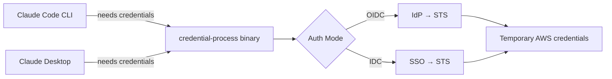
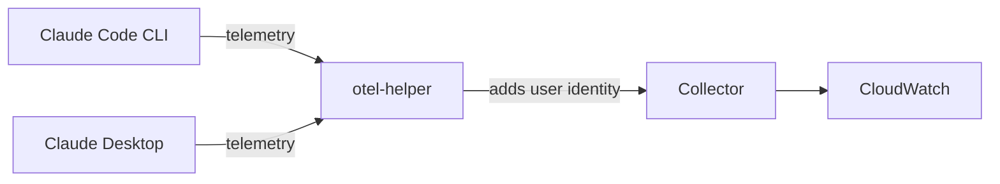
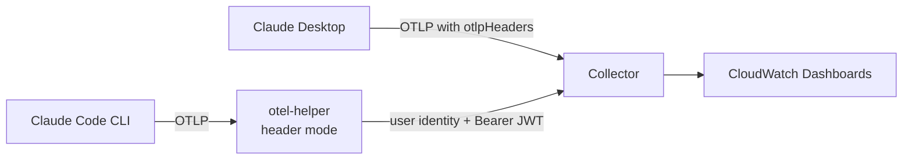
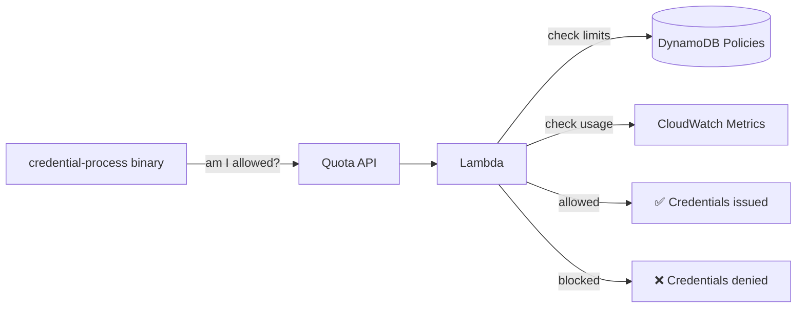

# Guidance for Claude Code and Cowork on Amazon Bedrock

[](https://github.com/aws-solutions-library-samples/guidance-for-claude-code-with-amazon-bedrock/releases/latest)
[](https://github.com/aws-solutions-library-samples/guidance-for-claude-code-with-amazon-bedrock/tree/beta)

This guidance enables enterprise deployment of Claude Code and Claude Cowork on Amazon Bedrock across command-line (CLI) and desktop surfaces — with secure single sign-on (SSO), usage monitoring, and cost controls.

## Key Features

- **Secure Access**: Secure single sign-on (SSO) with enterprise identity providers such as Okta, Entra ID, Auth0, Google, Cognito, or AWS IAM Identity Center — temporary credentials, automatic refresh, no API keys to manage
- **Usage Monitoring**: CloudWatch dashboards with per-user cost attribution, plus S3 + Athena for historical analytics
- **Quota Enforcement**: Per-user and per-team token limits with configurable thresholds, warnings, and block modes
- **Multi-Platform**: Windows, macOS, Linux — Go or Python binaries, pre-built from GitHub Releases
- **One Deployment, Two Surfaces**: Same infrastructure powers both Claude Code CLI and Claude Desktop (which features Chat, Cowork and Code)
- **Model Flexibility**: Choose from Opus, Sonnet, Haiku with model aliases (e.g. `opusplan` for Opus planning + Sonnet execution)
- **Native Desktop Experience**: Deploy and manage Claude Desktop via MDM (Jamf, Intune, Group Policy)
- **Dynamic Config Delivery**: Deliver per-user settings and [organization plugins](assets/docs/PLUGINS.md#bootstrap-server-delivery-dynamic) to Claude Desktop at sign-in via a bootstrap server — no MDM re-push needed for config changes
- **Data Residency**: Select your cross-region inference profile (US, EU, AU) to keep data within your compliance boundary
- **AWS-Native**: Your data, your AWS account, your compliance controls — no Anthropic licensing required

## Table of Contents

1. [Quick Start](#quick-start)
2. [Architecture Overview](#architecture-overview)
   - [Authentication Modes](#authentication-modes)
   - [Per-User Attribution](#per-user-attribution)
3. [How It Works](#how-it-works)
   - [Usage Monitoring](#usage-monitoring)
   - [Quota Enforcement and Cost Controls](#quota-enforcement-and-cost-controls)
4. [Deployment](#deployment)
5. [Additional Resources](#additional-resources)

## Quick Start

This guidance integrates Claude Code CLI and Claude Desktop with your existing OIDC identity provider (Okta, Entra ID, Auth0, Google, or Cognito User Pools) to provide federated access to Amazon Bedrock.

### What You Need

- An OIDC identity provider (Okta, Entra ID, Auth0, Google, Cognito) OR AWS IAM Identity Center
- AWS account with IAM and CloudFormation permissions
- Amazon Bedrock activated in target regions
- Python 3.10+ for deployment

### What Gets Deployed

- Authentication infrastructure (IAM OIDC Provider or IDC auth stack)
- Platform-specific installation packages (Windows, macOS, Linux)
- Optional: OpenTelemetry monitoring + quota enforcement

**Deployment time:** 2-3 hours for initial setup. See [QUICK_START.md](QUICK_START.md) for step-by-step instructions.

### Extend to Claude Cowork

If you've deployed this guidance for Claude Code, extend it to Claude Cowork (Claude Desktop) with one command:

```bash
poetry run ccwb cowork generate
```

This generates MDM configuration files (JSON, macOS .mobileconfig, Windows .reg) using your existing deployment profile. See the [CoWork 3P Guide](assets/docs/COWORK_3P.md) for setup and deployment details.

## Architecture Overview

The architecture is modular — start with authentication, then optionally add [monitoring, quota enforcement, analytics, or distribution](#what-gets-deployed) independently as requirements grow. This guidance supports three authentication paths (see [Authentication Modes](#authentication-modes) for details). The recommended path is Direct IAM Federation:

### Recommended: Direct IAM Federation


1. **User initiates authentication**: User requests access to Amazon Bedrock through Claude Code or Claude Cowork
2. **OIDC authentication**: User authenticates with their OIDC provider and receives an ID token
3. **Token exchange with AWS STS**: Application calls `AssumeRoleWithWebIdentity` with the OIDC ID token
4. **STS returns credentials**: AWS STS validates the token against the registered IAM OIDC provider and returns temporary AWS credentials (scoped to Bedrock access)
5. **Access Amazon Bedrock**: Application uses the temporary credentials to call Amazon Bedrock
6. **Bedrock response**: Amazon Bedrock processes the request and returns the response

### What Gets Deployed

`ccwb init` creates a profile that selects which stacks to enable. Deploy all at once with `ccwb deploy`, or individually with `--stack <name>`:

| Component | What | Deployed via |
|-----------|------|-------------|
| **Authentication** | IAM OIDC Provider + federated role, or IDC auth stack | `ccwb deploy --stack auth` |
| **User packages** | Platform-specific binaries (credential-process, otel-helper) + install scripts | `ccwb package` |
| **Monitoring** (optional) | Central mode: ECS Fargate OTEL collector + ALB. Sidecar mode: local collector on each machine. Both export to CloudWatch dashboards. | `ccwb deploy --stack monitoring` |
| **Quota enforcement** (optional) | Quota check API + DynamoDB policies + per-user/team limits | `ccwb deploy --stack quota` |
| **Analytics** (optional) | S3 data lake + Athena for historical SQL queries on usage data | `ccwb deploy --stack analytics` |
| **Distribution** (optional) | S3 presigned URLs or self-service landing page with IdP auth | `ccwb deploy --stack distribution` |
| **Diagnostics** | Installation health checks + resolved config dump | `ccwb doctor` |

See [Monitoring Guide](assets/docs/MONITORING.md), [Quota Guide](assets/docs/QUOTA_MONITORING.md), [Analytics Guide](assets/docs/ANALYTICS.md), and [Distribution Comparison](assets/docs/distribution/comparison.md) for detailed setup.
### Authentication Modes

This guidance supports three identity paths. Each path provides usage monitoring and audit trails. Per-user identity resolution and quota enforcement depend on the authentication mode chosen.

| Mode | `ccwb init` choice | Identity Source | Session Length | Quota Enforcement | Best For |
|------|--------------------|----------------|----------------|-------------------|----------|
| **External IdP (OIDC)** | `OIDC / Direct IdP` | Okta, Entra ID, Auth0, Google, Cognito User Pools JWT claims | Refresh token lifetime | ✅ Full | Orgs with an existing enterprise IdP |
| **AWS IAM Identity Center** | `AWS IAM Identity Center` | `AWSReservedSSO_*` IAM role ARN (email in session name) | Up to 90 days (recommended: 7 days) | ✅ Via SigV4 | Orgs on native AWS identity, or where OIDC localhost callback is blocked |
| **None** | `None` | IAM user ARN or hashed role principal | AWS credential TTL | ❌ Not available | Internal tools / analytics-only deployments |

For deployment patterns and best practices, see the [Claude Code deployment patterns and best practices with Amazon Bedrock](https://aws.amazon.com/blogs/machine-learning/claude-code-deployment-patterns-and-best-practices-with-amazon-bedrock/) blog post.

### Optional: Deploy Without SSO Authentication

You can deploy the observability/analytics stack without configuring an identity provider. Select **"None"** during `ccwb init`.

- No OIDC provider or IdP configuration required
- Uses AWS IAM for access control directly
- Identity detection is automatic (IDC users: email from ARN, IAM users: username, other roles: hashed identifier)
- Best for: internal tools, analytics-only deployments, or orgs where users already have IAM access to Bedrock

### Per-User Attribution

Per-user usage attribution works across all authentication modes and Claude Code CLI and Claude Desktop (Cowork):

| Auth Mode | Identity Source | Telemetry Attribution | Quota Enforcement | CUR 2.0 Cost Visibility |
|-----------|----------------|----------------------|-------------------|-------------------------|
| **OIDC** | JWT email claim | Per-user (email, team, department) | ✅ | ✅ Per-user via STS session tags |
| **IAM Identity Center** | IAM ARN session name | Per-user (email only) | ✅ | ✅ Per-user if [ABAC attributes](https://docs.aws.amazon.com/singlesignon/latest/userguide/abac.html) configured in IDC |
| **None** | Hashed IAM principal | Anonymous | ❌ | ✅ Per-IAM-role |

Usage from both Claude Code CLI and Claude Desktop (Cowork) counts toward the same per-user limit — a single quota applies regardless of which surface consumed the tokens.

See [Quota Monitoring Guide](assets/docs/QUOTA_MONITORING.md) for enforcement details and [CoWork 3P Guide](assets/docs/COWORK_3P.md#quota-enforcement) for Desktop-specific behavior.

## How It Works

Once distributed, the **credential-process** binary runs on each user's machine:
- **Claude Code:** configured via `credential_process` in `~/.aws/config` (AWS SDK calls it automatically)
- **Claude Desktop (Cowork):** configured via `inferenceBedrockProfile` MDM key pointing to the AWS profile that has `credential_process` set



The **otel-helper** binary attaches per-user identity to telemetry:

- **Header mode** (Claude Code CLI): Called once per OTLP export as a header provider. Returns JSON headers containing user identity (email, team, department) extracted from the cached JWT.
- **Bootstrap mode** (Claude Desktop, recommended): The [bootstrap server](assets/docs/PLUGINS.md#bootstrap-server-delivery-dynamic) delivers per-user `otlpHeaders` at sign-in. Claude Desktop applies these natively — no proxy or helper needed.
- **Static MDM** (Claude Desktop, basic): Set `otlpHeaders` in MDM config for device-level identity (not per-user unless you create per-device profiles).



### Usage Monitoring

Both Claude Code (CLI) and Claude Desktop emit OpenTelemetry (OTLP) telemetry. For Claude Code, otel-helper provides per-user identity headers. For Claude Desktop, the bootstrap server delivers per-user `otlpHeaders` at sign-in — no local proxy needed. See [Monitoring Guide](assets/docs/MONITORING.md) for detailed configuration.



| Surface | Per-user identity | How | Collector mode |
|---------|------------------|-----|----------------|
| **Claude Code (CLI)** | otel-helper (header mode) | Returns identity headers per export | Central or Sidecar |
| **Claude Desktop (bootstrap)** | Bootstrap server delivers `otlpHeaders` | Per-user from OIDC token at sign-in | Central |
| **Claude Desktop (static MDM)** | `otlpHeaders` in MDM config | Device-level (not per-user) | Central or Sidecar |

> **Recommended:** Use the [bootstrap server](assets/docs/PLUGINS.md#bootstrap-server-delivery-dynamic) for per-user Claude Desktop telemetry. It delivers `otlpHeaders` with user identity at sign-in — no local proxy or helper binary needed on the Desktop machine.

**Cost attribution:** Since April 2026, Amazon Bedrock supports [IAM principal cost tracking via CUR 2.0](assets/docs/COST_ATTRIBUTION.md) — per-user costs appear in Cost Explorer automatically from the STS session tags set by credential-process. Note: real-time quota enforcement relies on telemetry emitted from the client rather than actual costs metered by AWS, so figures may differ from CUR.

**Dashboards:** Pre-built CloudWatch dashboards for [Claude Code](assets/images/ClaudeCodeDashboard.png) and [Claude Desktop (Cowork)](assets/images/ClaudeCoworkDashboard.png). See [Monitoring Guide](assets/docs/MONITORING.md) for setup.

### Quota Enforcement and Cost Controls

Quota is enforced at the **credential layer** — before any Bedrock call is made:



How it works:
- **Policies** (DynamoDB): Admins set per-user or per-team monthly/daily token limits via `ccwb quota` commands
- **Usage** (CloudWatch): The OTEL collector aggregates token consumption metrics per user
- **Check** (Lambda): On each credential request, compares current usage against the policy limit
- **Enforcement**: If over limit, credentials are withheld and the user sees a quota exceeded message

If a user exceeds their quota, access to Bedrock is denied until usage resets or an admin unblocks them. See [Quota Guide](assets/docs/QUOTA_MONITORING.md) for configuration details.


## Deployment

### Requirements

- Python 3.10+, Poetry, AWS CLI v2, Git
- AWS account with Bedrock activated and IAM/CloudFormation permissions
- OIDC identity provider (Okta, Entra ID, Auth0, Google, Cognito) or AWS IAM Identity Center
- Go 1.24+ (optional — only for local builds; [pre-built binaries](https://github.com/aws-solutions-library-samples/guidance-for-claude-code-with-amazon-bedrock/releases) available from v2.4.0+)

**End users need only:** Claude Code or Claude Desktop installed. No Python, AWS account, or build tools required — IT distributes pre-built packages.

See [QUICK_START.md](QUICK_START.md) for the full step-by-step walkthrough.

### Supported Regions

Deploys to any AWS region with Bedrock support, across both AWS Commercial and AWS GovCloud (US) partitions. During `ccwb init`, select your region and the wizard auto-configures partition-appropriate models and endpoints.

### Cross-Region Inference

Select your preferred model (Opus, Sonnet, Haiku) and cross-region inference profile (US, EU, AU) for optimal routing and data residency. Modern Claude models (3.7+) require cross-region inference.

See [Model Configuration](https://code.claude.com/docs/en/model-config) for model aliases (including `opusplan` for Opus planning + Sonnet execution).

### Platform Support

| Platform | Architecture | Build Methods |
|----------|-------------|---------------|
| Windows | x64 | Go (recommended) or Nuitka via CodeBuild |
| macOS | ARM64 / Intel / Universal | Go or PyInstaller |
| Linux | x86_64 / ARM64 | Go or PyInstaller (Docker) |

**Pre-built binaries:** From v2.4.0+, [GitHub Releases](https://github.com/aws-solutions-library-samples/guidance-for-claude-code-with-amazon-bedrock/releases) include binaries for all platforms — no local build tools needed.

See [QUICK_START.md](QUICK_START.md#platform-builds) for build configuration.

## Additional Resources

### Getting Started

- [Quick Start Guide](QUICK_START.md) - Step-by-step deployment walkthrough
- [CLI Reference](assets/docs/CLI_REFERENCE.md) - Complete command reference for the `ccwb` tool
- [Troubleshooting](assets/docs/TROUBLESHOOTING.md) - Common issues, `ccwb doctor`, and how to file bugs
- [Workshop: Claude Code on Amazon Bedrock](https://catalog.workshops.aws/claude-code-on-amazon-bedrock/en-US) - Companion hands-on workshop
- [Claude Code deployment patterns and best practices with Amazon Bedrock](https://aws.amazon.com/blogs/machine-learning/claude-code-deployment-patterns-and-best-practices-with-amazon-bedrock/) - Blog post covering deployment patterns and best practices

### Architecture & Deployment

- [Architecture Guide](assets/docs/ARCHITECTURE.md) - System architecture and design decisions
- [Deployment Guide](assets/docs/DEPLOYMENT.md) - Advanced deployment options
- [Distribution Comparison](assets/docs/distribution/comparison.md) - Presigned URLs vs Landing Page vs Self-Service Portal (IAM Identity Center)
- [Local Testing Guide](assets/docs/LOCAL_TESTING.md) - Testing before deployment

### Monitoring & Analytics

- [Monitoring Guide](assets/docs/MONITORING.md) - OpenTelemetry setup and dashboards
- [Analytics Guide](assets/docs/ANALYTICS.md) - S3 data lake and Athena SQL queries

### Cost Management

- [Cost Estimates](assets/docs/COST_ESTIMATES.md) - High-level monthly cost estimates by deployment tier and team size
- [Cost Attribution](assets/docs/COST_ATTRIBUTION.md) - Per-user and per-team cost tracking via CUR 2.0 and Cost Explorer

### Plugins

- [Example Plugins](assets/claude-code-plugins/) - Example plugins for Claude Code and Cowork 3P ([distribution guide](assets/docs/PLUGINS.md))

### Claude Cowork (Desktop)

- [CoWork 3P Guide](assets/docs/COWORK_3P.md) - Setup and deployment for Claude Desktop with Bedrock
- [AWS Blog: Running Claude Cowork in Amazon Bedrock](https://aws.amazon.com/blogs/machine-learning/from-developer-desks-to-the-whole-organization-running-claude-cowork-in-amazon-bedrock/)

### Identity Provider Setup

- [Okta](assets/docs/providers/okta-setup.md)
- [Microsoft Entra ID](assets/docs/providers/microsoft-entra-id-setup.md)
- [Auth0](assets/docs/providers/auth0-setup.md)
- [Google](assets/docs/providers/google-oidc-setup.md)
- [AWS Cognito User Pool](assets/docs/providers/cognito-user-pool-setup.md)
- [Generic OIDC (PingFederate, Keycloak, ForgeRock, etc.)](assets/docs/providers/generic-oidc-setup.md)

## License

This project is licensed under the MIT License - see the [LICENSE](LICENSE) file for details.
