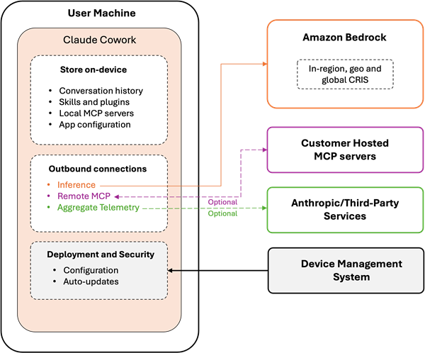
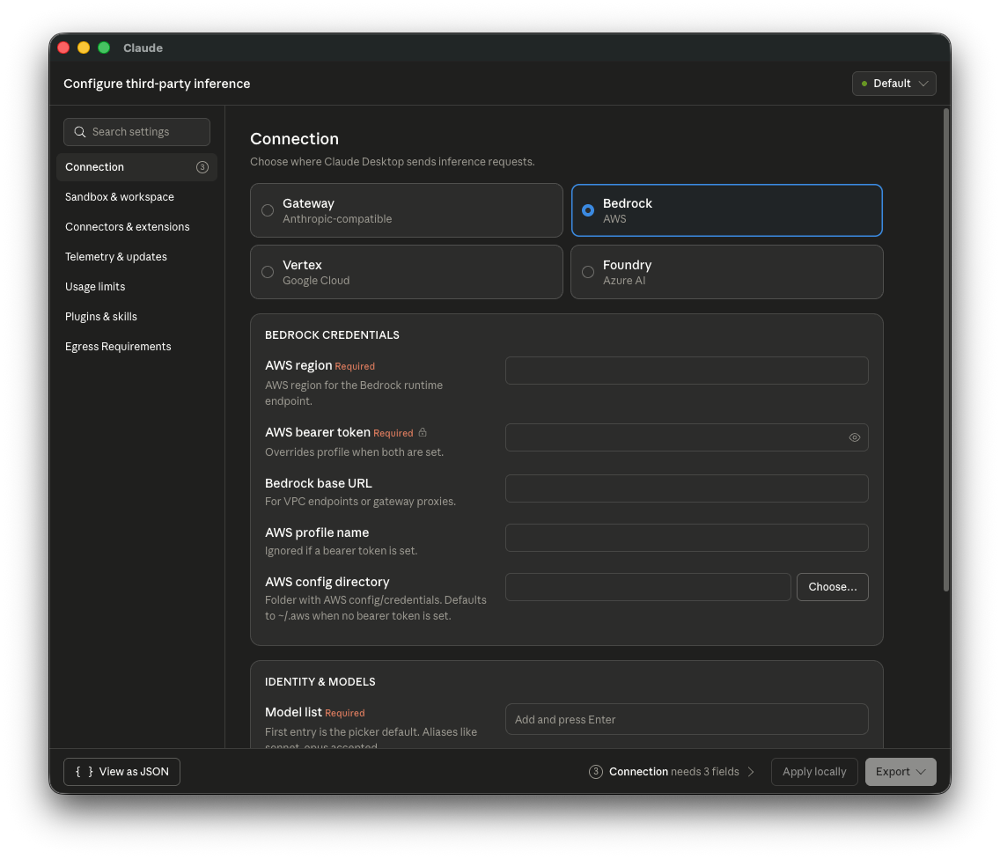
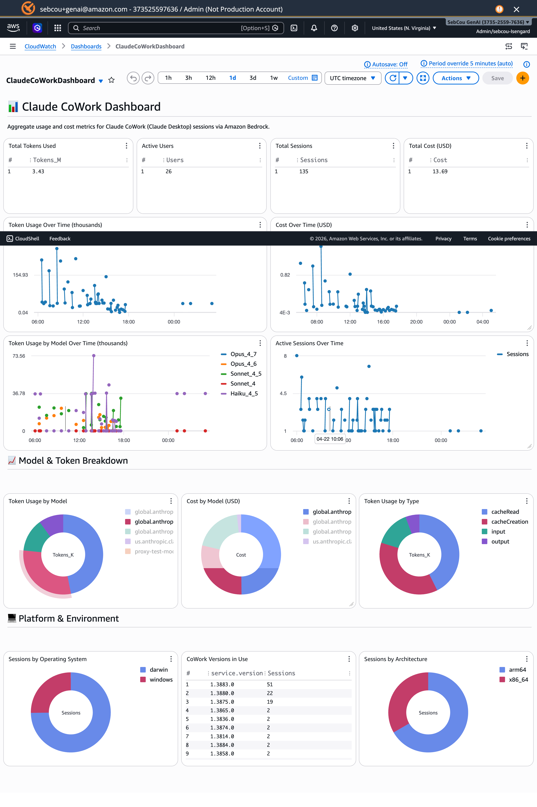

# Claude Cowork with Third-Party Platforms (CoWork 3P)

This guide explains how to use this solution's credential helper with **Claude Cowork** (Claude Desktop) in third-party platform mode, enabling enterprise-managed Claude Desktop deployments that authenticate through your existing identity provider.

## Overview

[Claude Cowork with third-party platforms](https://support.claude.com/en/articles/14680741-install-and-configure-claude-cowork-with-third-party-platforms) allows IT administrators to deploy Claude Desktop with Amazon Bedrock as the inference backend, managed via MDM configuration profiles. Users get core Claude Desktop capabilities including projects, artifacts, memory, file upload/export, and MCP servers — with consumption-based pricing through your existing AWS billing (no Anthropic seat licensing). Feature availability on Bedrock may differ from claude.ai.

> **Note:** Features that require Anthropic-hosted inference — including the Chat tab, Computer Use, and the Skills Marketplace — are not available in third-party platform mode. See the [Feature Matrix](https://claude.com/docs/cowork/3p/feature-matrix) for a full comparison.

**Key insight:** The same authentication infrastructure this solution provides for Claude Code CLI also covers Claude Cowork 3P. This means a single deployment supports both:

- **Claude Code** (terminal-based coding tool for developers)
- **Claude Cowork** (Claude Desktop for knowledge workers — product managers, analysts, operations teams)

No additional AWS infrastructure is required — if you've already deployed this solution for Claude Code, you can extend it to Claude Cowork immediately. Your data stays within your AWS account: Amazon Bedrock does not store prompts, files, tool inputs/outputs, or model responses.

### Architecture

The following diagram from the [AWS Blog](https://aws.amazon.com/blogs/machine-learning/from-developer-desks-to-the-whole-organization-running-claude-cowork-in-amazon-bedrock/) illustrates the end-to-end flow for Claude Cowork with Amazon Bedrock:



The application has three outbound paths: model inference to Amazon Bedrock in your configured regions, MCP server connections to endpoints you approve, and optional aggregate telemetry to Anthropic (which can be disabled).

## Prerequisites

Before configuring Claude Cowork 3P, ensure:

1. **This solution is deployed** — Follow the [Quick Start Guide](../../QUICK_START.md) to deploy authentication infrastructure
2. **Users have the credential-process installed** — Distribute via `ccwb package` as described in [Step 4 of Quick Start](../../QUICK_START.md#step-4-create-distribution-package)
3. **Claude Desktop is installed** — Download from [claude.com/download](https://claude.com/download)
4. **MDM solution available** — For deploying configuration profiles to managed devices

## Getting Started

The workflow depends on whether you've already deployed this solution for Claude Code:

**Existing deployments** (already ran `ccwb init` + `ccwb deploy`):
1. Run `ccwb cowork generate` to create MDM configuration files
2. Deploy the generated files to managed devices via your MDM solution
3. Distribute the `credential-process` binary to users (if not already done)

**New deployments** (starting from scratch):
1. Follow the [Quick Start Guide](../../QUICK_START.md) to deploy authentication infrastructure
2. Run `ccwb package` to build distribution packages — CoWork 3P configs are auto-generated alongside
3. Deploy MDM configuration files and distribute packages to users

## Configuration

There are three ways to create the MDM configuration. **Option 1 (CLI)** is recommended as it auto-generates from your deployment profile.

### Option 1: Generate via CLI (Recommended)

If you've deployed this solution, the `ccwb cowork generate` command auto-generates MDM configuration files from your existing deployment profile — no manual JSON editing required:

```bash
# Generate all formats (JSON, macOS .mobileconfig, Windows .reg)
poetry run ccwb cowork generate

# Generate only macOS profile
poetry run ccwb cowork generate --format mobileconfig

# Custom model list
poetry run ccwb cowork generate --models opus,sonnet,haiku

# Specific deployment profile
poetry run ccwb cowork generate --profile Production
```

Generated files are saved to `dist/cowork-3p/` by default. See [CLI Reference](CLI_REFERENCE.md#cowork-generate---generate-mdm-configuration) for all options.

CoWork 3P configs are also auto-generated alongside distribution packages during `ccwb package` when enabled via `ccwb init`.

### Option 2: Configure via Setup UI

Claude Desktop includes a built-in configuration interface for third-party inference. Once the credential-process is installed on the user's machine, you can configure it visually:

1. Open Claude Desktop
2. Navigate to **Menu Bar → Help → Troubleshooting → Enable Developer mode**
3. Go to **Developer → Configure third-party inference**
4. Select **Bedrock** as the inference provider



In the **Bedrock Credentials** section, configure:
- **AWS region**: Your Bedrock region (e.g., `us-west-2`)
- **AWS profile**: The named profile the installer writes to `~/.aws/config` — `ClaudeCode` by default

In the **Identity & Models** section:
- **Model list**: Add the model aliases your organization has enabled (e.g., `opus`, `sonnet`, `haiku`)

Once configured, use **Export** to generate a `.mobileconfig` (macOS) or `.reg` (Windows) file for MDM distribution, or **Apply locally** for immediate testing.

After applying the configuration, Claude Desktop will detect the Bedrock setup and present the option to continue:


Select **Continue with Bedrock** to start using Claude with your organization's credentials.

### Option 3: JSON MDM Configuration

For automated deployment at scale, create an MDM profile with the following essential keys:

```json
{
  "inferenceProvider": "bedrock",
  "inferenceBedrockRegion": "us-west-2",
  "inferenceBedrockProfile": "ClaudeCode",
  "inferenceModels": ["opus", "sonnet", "haiku"]
}
```

> **Note:** `inferenceBedrockProfile` must match a profile defined in the user's `~/.aws/config` (or `%USERPROFILE%\.aws\config` on Windows). The `install.sh` / `install.bat` installer shipped by `ccwb package` writes that profile automatically with `credential_process = credential-process --profile <name>`, so Claude Desktop reuses the same authentication pipeline as Claude Code CLI — no extra wrapper script to ship or maintain.

> **Note:** See the [Configuration Reference](#configuration-reference) below for the full set of optional MDM keys (telemetry, extensions, auto-updates, workspace caps, etc.).

### Key Configuration Fields

| Key | Description |
|-----|-------------|
| `inferenceProvider` | Must be set to `"bedrock"` to activate third-party platform mode with Amazon Bedrock |
| `inferenceBedrockProfile` | Name of the AWS named profile in `~/.aws/config` that Claude Desktop should use for Bedrock calls. The installer configures this profile with `credential_process` pointing at the bundled `credential-process` binary |
| `inferenceBedrockRegion` | AWS region for Bedrock API calls (e.g., `us-west-2`, `us-east-1`) |
| `inferenceBedrockAwsDir` | Path to the directory containing AWS config/credentials files (default: `~/.aws`) |
| `inferenceModels` | JSON array of model entries. Supports simple aliases (`["opus", "sonnet", "haiku"]`) or object entries with tier tagging (see below). First entry is the default |

> **Note:** The model aliases used by CoWork 3P (`opus`, `sonnet`, `haiku`) are resolved internally by Claude Desktop and may differ from the CRIS model IDs configured for Claude Code via `ANTHROPIC_MODEL`. The `ccwb cowork generate` command includes all available aliases by default. Use `--models` to customize the list for your organization.

#### Model Entries with Family Tier (v1.13576+)

Claude Desktop supports object entries in `inferenceModels` with `anthropicFamilyTier` and `isFamilyDefault` fields. This lets tier shortcuts (like "opus" and "sonnet" in the model picker) resolve to your specific Bedrock model IDs:

```json
"inferenceModels": [
  {
    "name": "global.anthropic.claude-opus-4-8",
    "labelOverride": "Claude Opus 4.8",
    "anthropicFamilyTier": "opus",
    "isFamilyDefault": true
  },
  {
    "name": "global.anthropic.claude-sonnet-4-6",
    "labelOverride": "Claude Sonnet 4.6",
    "anthropicFamilyTier": "sonnet",
    "isFamilyDefault": true
  },
  {
    "name": "global.anthropic.claude-haiku-4-5-20251001-v1:0",
    "labelOverride": "Claude Haiku 4.5",
    "anthropicFamilyTier": "haiku",
    "isFamilyDefault": true
  }
]
```

| Field | Type | Description |
|-------|------|-------------|
| `name` | string | The model ID your provider routes (e.g., CRIS inference profile ID) |
| `labelOverride` | string | Optional display name in the model picker |
| `anthropicFamilyTier` | string | Which Claude tier this model stands in for: `opus`, `sonnet`, `haiku`, or `fable` |
| `isFamilyDefault` | boolean | Whether this is the default model when the tier shortcut is used |
| `supports1m` | boolean | Whether the model supports 1M token context |

> **When to use object format:** Use it when your Bedrock setup uses specific CRIS inference profile IDs (e.g., `global.anthropic.claude-opus-4-8`) and you want the tier shortcuts in the Claude Desktop model picker to resolve to those exact model IDs. The simple alias format (`["opus", "sonnet", "haiku"]`) still works and lets Claude Desktop handle resolution internally.

### How Credentials Flow

This solution supports two credential modes for CoWork. The **credential helper** mode (default since v2.6.0) is recommended because it gives Claude Desktop direct control over credential lifecycle, eliminating the stale-credential bug that required manual app restarts.

#### Credential Helper Mode (Recommended)

When Claude Cowork starts a session:

1. Claude Desktop reads `inferenceCredentialHelper` from the MDM policy — this points directly at the credential-process binary
2. Claude Desktop runs the binary and reads temporary AWS credentials from stdout
3. The output is cached for `inferenceCredentialHelperTtlSec` seconds (default: 3500, just under the 1h STS token lifetime)
4. When the cache expires, Claude Desktop automatically re-runs the helper — **no restart required**
5. If credentials are rejected mid-session, Claude Desktop re-runs with `CLAUDE_HELPER_CONTEXT=mid-session-refresh` for seamless recovery (20s timeout)

The credential-process binary handles the `CLAUDE_HELPER_CONTEXT` environment variable:
- `interactive` → Full browser-based OIDC authentication
- `mid-session-refresh` → Silent refresh via cached refresh_token (no browser)
- `background` / `setup-test` → Silent path only, exit non-zero if unavailable

This mode resolves the known issue where CoWork doesn't automatically refresh AWS credentials after token expiry (affecting both IDC and OIDC/Azure AD federated auth users).

Ref: [Claude Desktop Credential Helper documentation](https://claude.com/docs/third-party/claude-desktop/credential-helper)

#### AWS Profile Mode (Legacy)

The legacy flow uses `inferenceBedrockProfile` instead:

1. Claude Desktop reads `inferenceBedrockProfile` from the applied MDM policy (registry on Windows, managed preference on macOS)
2. It hands that profile name to the AWS SDK, which resolves the corresponding `[profile <name>]` stanza in `~/.aws/config`
3. The stanza's `credential_process = .../credential-process --profile <name>` entry runs the bundled credential-process binary
4. The binary authenticates the user via your OIDC provider (Okta, Azure AD, Auth0, etc.) and returns temporary AWS credentials in the standard AWS `credential_process` JSON format
5. The AWS SDK signs each Bedrock call with those credentials; caching and refresh are handled automatically by the SDK

To use this mode, set `cowork_credential_mode = "profile"` in your deployment profile before running `ccwb cowork generate`.

No wrapper script is required — CoWork reuses the same `credential-process` binary and `~/.aws/config` entry that `install.sh` / `install.bat` already configure for Claude Code CLI.

> ⚠️ **boto3 resolves `~/.aws/credentials` before `~/.aws/config`.** If `~/.aws/credentials` contains a `[<profile-name>]` block matching `inferenceBedrockProfile` — whether written by another tool or by this solution in session-storage mode — boto3 uses it directly and does **not** fall through to `credential_process` to refresh it. CoWork works as long as those static credentials remain valid, then fails with `403 The security token included in the request is invalid` the moment they expire (or immediately, if the block contains stale `EXPIRED` placeholders from a past logout). The installer shipped by `ccwb package` purges any such stanza before writing the new profile, and keyring-mode builds never write to `~/.aws/credentials` at all — which is why **Keyring is the recommended credential storage method when CoWork 3P is in scope**.

## Deployment

### macOS (MDM Configuration Profile)

1. Create the MDM configuration JSON with your settings
2. Export as a `.mobileconfig` file or use Claude Desktop's built-in setup UI:
   - Open Claude Desktop → Menu Bar → Help → Troubleshooting → Enable Developer mode
   - Developer → Configure third-party inference
   - Configure fields and export the `.mobileconfig`
3. Deploy via your MDM solution (Jamf, Kandji, Mosyle, etc.)

### Windows (Registry)

1. Create the MDM configuration JSON with your settings
2. Export as a `.reg` file via the Claude Desktop setup UI, or create registry entries manually
3. Deploy via Group Policy, Intune, or your MDM solution

### VDI Environments

In VDI deployments, either:
- Set MDM keys in the golden image so every cloned session inherits them
- Push keys at runtime through your VDI broker's policy system

Ensure the `credential-process` binary is included in the VDI image and that `~/.aws/config` contains the named profile referenced by `inferenceBedrockProfile`.

## Configuration Reference

The full set of MDM configuration keys is documented in the [official Anthropic guide](https://support.claude.com/en/articles/14680741-install-and-configure-claude-cowork-with-third-party-platforms). Below is a summary of the most relevant categories.

### Inference Settings

| Key | Type | Description |
|-----|------|-------------|
| `inferenceProvider` | string | Selects inference backend. Set to `bedrock` for Amazon Bedrock |
| `inferenceBedrockRegion` | string | AWS region for Bedrock |
| `inferenceBedrockAwsDir` | string | Path to AWS config directory (default: `~/.aws`) |
| `inferenceBedrockBaseUrl` | string | Override Bedrock endpoint (e.g., VPC interface endpoint) |
| `inferenceModels` | string | JSON-encoded array of model aliases (e.g., `"[\"opus\", \"sonnet\", \"haiku\"]"`) |
| `inferenceBedrockProfile` | string | Named AWS profile (in `~/.aws/config`) that Claude Desktop uses for Bedrock authentication |

> **Note:** Array-typed MDM keys (such as `inferenceModels`, `managedMcpServers`, `allowedWorkspaceFolders`) are delivered as **JSON-encoded strings** — the value is a string containing a JSON array, not a native array. For example, `inferenceModels` is set to `"[\"opus\", \"sonnet\"]"`, not `["opus", "sonnet"]`. The Claude Desktop Setup UI and the `.mobileconfig`/`.reg` export handle this encoding automatically.

### Deployment and Updates

| Key | Type | Description |
|-----|------|-------------|
| `deploymentOrganizationUuid` | string | Stable UUID identifying this deployment |
| `disableDeploymentModeChooser` | boolean | Hide the deployment mode chooser UI |
| `disableAutoUpdates` | boolean | Block automatic update checks and downloads |
| `autoUpdaterEnforcementHours` | integer | Force pending update after this many hours |

### MCP, Plugins, and Tools

| Key | Type | Description |
|-----|------|-------------|
| `isClaudeCodeForDesktopEnabled` | boolean | Show the Code tab (terminal coding sessions) |
| `isDesktopExtensionEnabled` | boolean | Permit local desktop extension installation |
| `isDesktopExtensionDirectoryEnabled` | boolean | Show the Anthropic extension directory |
| `isDesktopExtensionSignatureRequired` | boolean | Require signed desktop extensions |
| `isLocalDevMcpEnabled` | boolean | Permit user-added local MCP servers |
| `managedMcpServers` | string | JSON array of managed MCP server configs |
| `disabledBuiltinTools` | string | JSON array of tool names to disable |

### Telemetry

| Key | Type | Description |
|-----|------|-------------|
| `disableEssentialTelemetry` | boolean | Block crash/error reports and performance data |
| `disableNonessentialTelemetry` | boolean | Block product usage analytics |
| `disableNonessentialServices` | boolean | Block connector favicons and artifact preview |
| `otlpEndpoint` | string | OTLP collector URL for observability export |
| `otlpProtocol` | string | OTLP protocol (`http/protobuf`, `http/json`, or `grpc`) |
| `otlpHeaders` | string | Headers for OTLP requests |

### Workspace and Usage Caps

| Key | Type | Description |
|-----|------|-------------|
| `allowedWorkspaceFolders` | string | JSON array of allowed workspace folder paths |
| `inferenceMaxTokensPerWindow` | integer | Token cap per tumbling window |
| `inferenceTokenWindowHours` | integer | Tumbling window length in hours (max 720) |

## Custom MDM Keys

Administrators often need to set additional MDM keys beyond the defaults generated by `ccwb cowork generate`. Common examples include:

| Key | Purpose |
|-----|---------|
| `coworkEgressAllowedHosts` | Allow Claude Desktop to access external hosts (required for Web Fetch) |
| `coworkWebSearchEnabled` | Enable web search capability |
| `managedMcpServers` | Deploy managed MCP servers (e.g., Brave Search for web search on Bedrock) |
| `disabledBuiltinTools` | Lock down specific tools |
| `allowedWorkspaceFolders` | Restrict workspace access to approved directories |

### Configuring via `ccwb init`

During the interactive `ccwb init` wizard, you'll be prompted to add custom MDM keys when CoWork 3P is enabled:

```
Claude Cowork (Desktop) Support
Generate CoWork 3P MDM configuration during packaging? Yes
Would you like to add custom MDM keys? Yes
New MDM key name (empty to finish): coworkEgressAllowedHosts
Value for 'coworkEgressAllowedHosts': ["*"]
✓ MDM key: coworkEgressAllowedHosts=["*"]
New MDM key name (empty to finish): coworkWebSearchEnabled
Value for 'coworkWebSearchEnabled': true
✓ MDM key: coworkWebSearchEnabled=true
New MDM key name (empty to finish):
```

### Configuring via profile JSON

You can also edit the profile JSON directly at `~/.ccwb/profiles/<name>.json`:

```json
{
  "cowork_3p_enabled": true,
  "cowork_3p_extra_keys": {
    "coworkEgressAllowedHosts": "[\"*\"]",
    "coworkWebSearchEnabled": "true",
    "managedMcpServers": "[{\"name\":\"brave-search\",\"command\":\"npx\",\"args\":[\"-y\",\"@anthropic-ai/mcp-server-brave-search\"]}]",
    "allowedWorkspaceFolders": "[\"/Users\",\"/home\"]"
  }
}
```

Custom keys are merged into the generated MDM configuration after the base keys and monitoring configuration, so they can override defaults if needed.

> **Note:** Values should be strings, including for booleans (`"true"`) and arrays (`"[\"item1\"]"`). This matches how MDM systems deliver configuration — all values are stored as strings in the OS preference store.


## Web search via AgentCore Gateway

In addition to a self-managed MCP server (such as the `brave-search` example above, which runs locally via `npx` and a third-party API), the solution can provision a **fully managed, AWS-native web search** through an **Amazon Bedrock AgentCore Gateway** with the managed Web Search connector. Queries are served by Amazon's web index and **never leave AWS** — no third-party search API or outbound search credentials are involved.

When enabled, `ccwb package` (and `ccwb cowork generate`) automatically inject a `managedMcpServers` entry named **`agentcore-websearch`** into the generated MDM config — you do **not** add it by hand.

### Enabling it

1. **`ccwb init`** — answer *yes* to the web search question (web search is opt-in, default off).
2. **`ccwb deploy websearch`** — deploys the AgentCore Gateway + Web Search connector, reusing your existing identity provider for inbound authorization. The gateway endpoint is saved to your profile.
3. **`ccwb package`** (or `ccwb cowork generate`) — injects the `agentcore-websearch` MCP server into the `.json` / `.mobileconfig` / `.reg` outputs, and `install.sh` drops a small `websearch-headers` helper next to `credential-process`.

The generated entry is a **remote MCP server** pointing at your gateway, authenticated with a `headersHelper` script. It is emitted as a JSON-encoded string, like all array/object MDM values:

```json
{
  "name": "agentcore-websearch",
  "url": "https://<gateway-id>.gateway.bedrock-agentcore.us-east-1.amazonaws.com/mcp",
  "headersHelper": "/Users/<you>/claude-code-with-bedrock/websearch-headers",
  "headersHelperTtlSec": 900
}
```

Claude Desktop treats this as a generic remote MCP server and speaks standard MCP JSON-RPC, which the AgentCore Gateway understands. (The built-in `server: "websearch"` / `provider: "custom"` connector is **not** used: it sends a request body the gateway cannot parse, which surfaces in Cowork as "No results" even though authentication succeeds.)

### How authentication works

The `headersHelper` is a tiny executable that `ccwb package` installs next to `credential-process` (`<home>/claude-code-with-bedrock/websearch-headers`). On each MCP request — and again every `headersHelperTtlSec` (900s) — Claude Desktop runs it and attaches whatever headers it prints. The helper execs `credential-process --get-mcp-auth-header` (the browserless, Go/Python-parity MCP-header mode) which emits:

```json
{"Authorization": "Bearer <id_token>"}
```

That mode reads the cached id_token and silently refreshes it via the stored refresh token when expired; it **never** opens a browser (a headersHelper cannot drive an interactive login). The gateway's `CUSTOM_JWT` authorizer validates that id_token. An OIDC **id_token** carries `aud = clientId` for every provider, so the gateway is deployed with **`AllowedAudience = [clientId]`** (the template default) — there is no provider-specific authorizer to configure. The TTL is kept below the token lifetime (Cognito ~1h) so an expiring bearer is refreshed before it lapses.

> **Absolute paths (important).** Claude Desktop on macOS does **not** expand `~` (or env vars) in MDM string values, so the `headersHelper`/`inferenceCredentialHelper` paths must be absolute. Because the `.mobileconfig` is generated centrally, the macOS paths embed a `__CCWB_HOME__` placeholder and `install.sh` substitutes it with the user's real `$HOME` at install time — one artifact distributes centrally, each machine gets a correct absolute path. Windows uses the native `%USERPROFILE%`. To pin a fixed path yourself, set `websearch_headers_helper_path` on the profile (applied verbatim to every format).

> **Web Fetch.** Web search returns titles, URLs, and snippets; opening those result pages needs sandbox egress, which Cowork blocks by default. When web search is enabled, `ccwb` sets `coworkEgressAllowedHosts=["*"]` automatically (with a warning) so results are usable out of the box. `["*"]` allows egress to **all** hosts — **narrow it to a targeted domain list for production** by setting `coworkEgressAllowedHosts` yourself (e.g. via `cowork_3p_extra_keys`); an admin-provided value is never overwritten.

### Things to know

- **Region:** the managed Web Search connector is currently available in **`us-east-1` only**, so the gateway is deployed there regardless of your other stacks' region.
- **Data residency:** web search queries (or fragments of user prompts) are processed in `us-east-1`. Review compliance impact for regulated workloads before enabling.
- **Cost:** approximately **$7 per 1,000 queries**, billed to your AWS account.
- **Identity providers:** works with the solution's OIDC providers (Amazon Cognito, Microsoft Entra ID, Okta, Auth0, Google, generic OIDC). Because the bearer is an id_token (`aud = clientId`) validated by `AllowedAudience`, **no provider-specific setup is required**. See [Microsoft Entra ID setup → web search](providers/microsoft-entra-id-setup.md#10-web-search-for-claude-cowork-entra-id-notes) for notes.

> **Claude Code & joint documentation.** The equivalent web search capability for the **Claude Code CLI** (injected into `settings.json` via the credential helper) is delivered by a separate contribution and is **not** documented here yet. A single consolidated `WEB_SEARCH.md` covering both surfaces (Claude Code + Cowork) is planned once that work lands. Note: the merged CloudFormation template PR shipped the gateway template only — it did not include a standalone usage doc.


## Verification

After deploying the MDM profile:

1. Launch Claude Desktop on a test machine
2. Verify you see the third-party platform mode indicator (no login prompt for claude.ai)
3. Start a conversation — Claude should respond using Bedrock inference
4. Check that the credential helper authenticates correctly (user may see an SSO browser prompt on first use)

If users see an error at launch, verify:
- The `inferenceProvider` key is set to `bedrock`
- The `inferenceBedrockProfile` value matches a profile defined in the user's `~/.aws/config`
- That profile's `credential_process` line points at the installed `credential-process` binary and includes `--profile <name>`
- The `credential-process` binary exists at `~/claude-code-with-bedrock/` (or `%USERPROFILE%\claude-code-with-bedrock\` on Windows) and is executable
- The user has completed at least one authentication via `credential-process` (to establish the initial SSO session)

## Monitoring

When a monitoring stack is deployed, `ccwb cowork generate` automatically includes the `otlpEndpoint` in the generated MDM config, pointing Claude Cowork at the same OpenTelemetry collector used by Claude Code. No manual configuration is required.

Claude Cowork sends the following OTLP metrics to the collector:

| Metric | Description |
|--------|-------------|
| `claude_code.token.usage` | Token counts by type (`input`, `output`, `cacheRead`, `cacheCreation`) |
| `claude_code.cost.usage` | Estimated cost in USD (client-side approximation) |
| `claude_code.session.count` | Number of active sessions |

These are displayed in the **Claude CoWork Dashboard** in CloudWatch, which shows aggregate token usage, cost, sessions, model breakdown, and platform distribution.

### Per-device identity

Every CoWork 3P OTEL event includes a `user.id` attribute — an anonymous device/installation UUID generated by Claude Desktop. This identifies each device uniquely and can be used for:

- Per-device cost attribution and chargeback
- Identifying high-usage devices
- Correlating CoWork usage with Claude Code quota data

> **Note:** `user.id` is a device identifier, not a human identity. To map devices to users, maintain a device enrollment registry (e.g., populated during `ccwb package` distribution or MDM enrollment).

> **Note:** `user.email`, `user.account_uuid`, and `organization.id` are only available in Claude.ai-managed CoWork deployments (not 3P).  

Per-device dashboard dimensions are planned — see [#585](https://github.com/aws-solutions-library-samples/guidance-for-claude-code-with-amazon-bedrock/issues/585). Both central and sidecar monitoring modes are supported for CoWork telemetry.



## Quota Enforcement

CoWork 3P usage is subject to the same per-user quota enforcement as Claude Code. Here's how it works:

### How enforcement applies

CoWork uses `credential-process` for credential refresh (via the `inferenceBedrockProfile` AWS named profile). The credential-process binary checks the quota API on every refresh cycle:

1. CoWork's AWS session token expires (~1 hour)
2. AWS SDK calls `credential-process --profile <name>` for fresh credentials
3. `credential-process` calls the quota-check API (`GET /check`)
4. If the user is over quota → credentials are denied → CoWork loses Bedrock access
5. If under quota → fresh credentials issued → CoWork continues

**Enforcement granularity:** Per credential refresh (~1 hour). A user can exceed their quota within a session but will be blocked on the next refresh.

### How CoWork usage is counted

CoWork sends OTLP **log events** (not metrics) to the collector. The monitoring pipeline processes them:

1. CoWork sends `claude_code.api_request` log events to the OTEL collector
2. Collector injects `user_email` from HTTP attribution headers
3. Events are written to `/aws/claude-cowork/events` CloudWatch Logs
4. MetricFilters extract per-user token counts into the `ClaudeCoWork` namespace (with `user_email` dimension)
5. `quota_monitor` Lambda queries both `ClaudeCode` and `ClaudeCoWork` PromQL metrics
6. Combined usage is aggregated into a single DynamoDB record per user

**Result:** A user's total quota includes both Claude Code CLI and CoWork Desktop usage.

### Requirements for per-user CoWork quota

- Monitoring stack deployed (central mode with custom domain + HTTPS, or sidecar mode with local proxy)
- CoWork service token configured (`ccwb init` generates it)
- Attribution headers flowing (credential-process provides `x-user-email`)
- CoWork dashboard stack deployed (`ccwb deploy --stack cowork-dashboard`)

### Limitations

- **No inline blocking:** CoWork calls Bedrock directly via AWS credentials. There is no per-request interception — enforcement happens at credential refresh boundaries only.
- **Attribution required:** If `x-user-email` header is not configured, CoWork usage is aggregate-only and cannot be attributed to individual users for quota purposes.
- **CoWork-native `user.id`:** The opaque hash in raw CoWork events cannot be mapped back to an email without a separate device registry.

## Additional Resources

- [AWS Blog: From Developer Desks to the Whole Organization — Running Claude Cowork in Amazon Bedrock](https://aws.amazon.com/blogs/machine-learning/from-developer-desks-to-the-whole-organization-running-claude-cowork-in-amazon-bedrock/)
- [Official Anthropic Guide: Install and Configure Claude Cowork with Third-Party Platforms](https://support.claude.com/en/articles/14680741-install-and-configure-claude-cowork-with-third-party-platforms)
- [Claude Cowork 3P Configuration Reference](https://claude.com/docs/cowork/3p/configuration)
- [Claude Cowork 3P Feature Matrix](https://claude.com/docs/cowork/3p/feature-matrix)
- [Claude Cowork with Third-Party Platforms Overview](https://support.claude.com/en/articles/14680729-use-claude-cowork-with-third-party-platforms)
- [Extend Claude Cowork with Third-Party Platforms](https://support.claude.com/en/articles/14680753-extend-claude-cowork-with-third-party-platforms)
- [Quick Start Guide](../../QUICK_START.md) — Deploy the authentication infrastructure
- [Monitoring Guide](MONITORING.md) — OpenTelemetry monitoring setup
