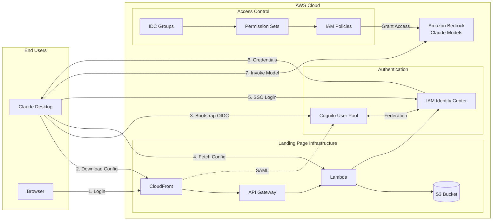
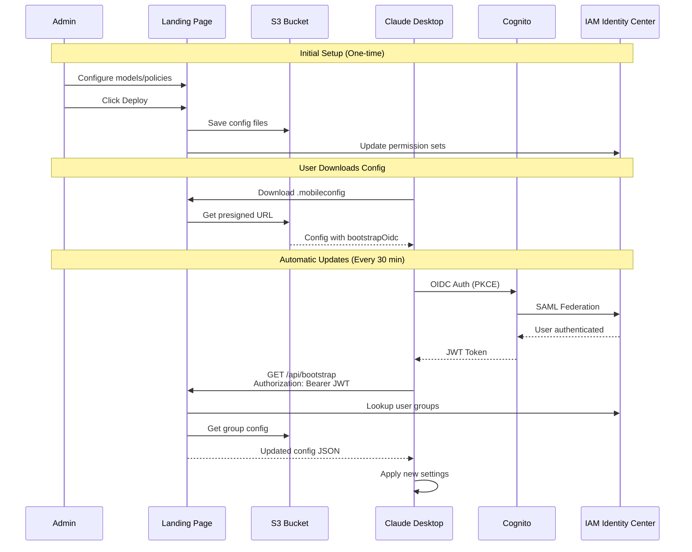
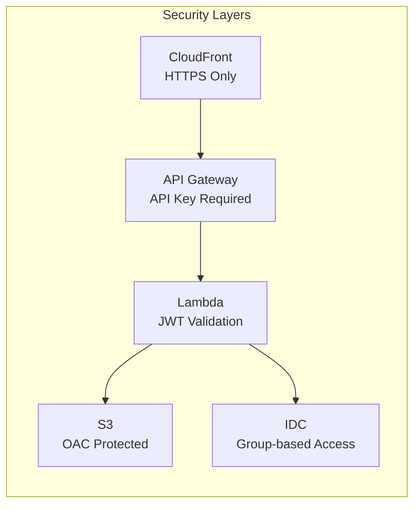

# Claude Desktop Self-Service Portal with IAM Identity Center

Self-service portal for distributing Claude Desktop configurations with Amazon Bedrock, authenticated via IAM Identity Center (IDC). Includes an admin console for managing model access, enterprise policies, and MCP server configurations with automatic config updates.

## Features

- **Self-Service Portal** - Users download configs for their platform (macOS, Windows, JSON)
- **Admin Console** - Configure models, policies, and MCP servers per group
- **IAM Identity Center Integration** - SSO authentication with group-based access control
- **Enterprise Policy Controls** - Tool restrictions, workspace limits, network egress rules
- **MCP Server Management** - Pre-configure remote and local MCP servers for users
- **Dynamic Config Updates** - Changes propagate automatically via OIDC bootstrap (every 30 min)
- **No Custom Domain Required** - Uses CloudFront's default `*.cloudfront.net` with free SSL

## Architecture



## Bootstrap Dynamic Configuration Flow



## Admin Console Features

### Model Access Control
Assign Claude models to IDC groups. Each group gets a permission set with IAM policies scoped to their allowed models.

### Enterprise Policies
| Policy | Description |
|--------|-------------|
| Disabled Tools | Block specific built-in tools (Bash, Edit, Write, etc.) |
| Tool Policies | Fine-grained allow/deny per tool |
| Local MCP | Enable/disable user-installed MCP servers |
| Desktop Extensions | Control IDE extension access |
| Cowork Tab | Enable/disable agentic features |
| Workspace Folders | Restrict which directories users can attach |
| Network Egress | Limit which hosts tools can connect to |

### MCP Server Configuration
- **Remote MCP Servers** - Pre-configure HTTPS MCP servers (OAuth-authenticated)
- **Local MCP Templates** - Provide templates for GitHub, Slack, filesystem, etc.

### Dynamic Configuration Updates
MDM profiles include `bootstrapOidc` configuration that enables Claude Desktop to:
1. Authenticate via Cognito OIDC (federated with IAM Identity Center)
2. Call the bootstrap API every 30 minutes with a fresh JWT
3. Receive and apply updated configuration automatically

> **Note:** The 30-minute refresh interval is controlled by Claude Desktop and cannot be changed server-side. For urgent updates (e.g., security policy changes), ask users to restart Claude Desktop to fetch changes immediately.

## Prerequisites

### Tools Required
- AWS CLI configured with appropriate permissions
- Node.js 18+ and npm
- CDK CLI (`npm install -g aws-cdk`)
- jq (`brew install jq` on macOS)

### IAM Identity Center Requirements

1. **IAM Identity Center enabled** in your AWS account

2. **Groups for Claude Desktop users** - Typically synced from your identity provider (Active Directory, Okta, Azure AD):
   - Groups should include `Claude` in the name for the admin UI to filter them
   - Example: `Claude-Developers`, `Claude-Contractors`, `Claude-Data-Scientists`

3. **Admin group** - For administrators who manage the portal:
   - Must contain both `Claude` and `Admin` in the name
   - Example: `Claude-Admins`, `Claude-Code-Admins`

4. **Permission to add applications in IAM Identity Center** - After deployment, you (or whoever
   completes SAML setup) will need permission to create a **Custom SAML 2.0 application** under
   **IAM Identity Center → Applications**. This is a manual, one-time step covered in
   [Step 4: Configure SAML in IAM Identity Center](#step-4-configure-saml-in-iam-identity-center)
   below — it cannot be automated or done before deployment, since the SAML ACS URL and Audience
   depend on the Cognito User Pool created in Step 2.

## Deployment

### Step 1: Configure Settings

Edit `lib/config.ts`:

```typescript
export const config: LandingPageConfig = {
  profileName: 'my-company',
  idcInstanceArn: 'arn:aws:sso:::instance/ssoins-xxxxxxxxx',
  region: 'us-east-1',
  account: '123456789012',
  bootstrapOidcClientId: '',  // Will be set after creating the Cognito client
};
```

### Step 2: Deploy Infrastructure

```bash
npm install
npx cdk deploy --all
```

This deploys:
- Cognito User Pool (SAML federation with IDC)
- CloudFront distribution
- API Gateway + Lambda
- S3 bucket for configs

### Step 3: Create Bootstrap OIDC Client

Create a Cognito app client for Claude Desktop bootstrap:

```bash
aws cognito-idp create-user-pool-client \
  --user-pool-id <USER_POOL_ID> \
  --client-name "claude-desktop-bootstrap" \
  --no-generate-secret \
  --supported-identity-providers "IAMIdentityCenter" \
  --callback-urls "http://127.0.0.1:8080/callback" \
  --allowed-o-auth-flows "code" \
  --allowed-o-auth-scopes "openid" "email" "profile" \
  --allowed-o-auth-flows-user-pool-client
```

Update `lib/config.ts` with the client ID and redeploy:

```bash
npx cdk deploy --all
```

### Step 4: Configure SAML in IAM Identity Center

1. **IAM Identity Center** → **Applications** → **Add application** → **Custom SAML 2.0**

2. Configure:
   - **Display name:** `Claude Desktop Portal`
   - **ACS URL:** `https://<COGNITO_DOMAIN>.auth.<REGION>.amazoncognito.com/saml2/idpresponse`
   - **Audience:** `urn:amazon:cognito:sp:<USER_POOL_ID>`

3. **Attribute mappings:**
   | Application attribute | Maps to |
   |----------------------|---------|
   | `Subject` | `${user:email}` (Format: emailAddress) |
   | `email` | `${user:email}` |
   | `name` | `${user:name}` |

4. **Assign groups** to the application (Admins, Developers, etc.)

5. **Copy the SAML metadata URL** for the next step

### Step 5: Configure Cognito

**Recommended — via `ccwb configure-saml`:**

If you deployed through the `ccwb` CLI (`ccwb init` → `distribution_type: landing-page-idc` → `ccwb deploy distribution`), run:

```bash
poetry run ccwb configure-saml <metadata-url-from-step-4>
```

This automates the rest of Step 5: it creates (or updates) the `IAMIdentityCenter` SAML identity provider on your Cognito User Pool, and enables it on **both** the web app client and the bootstrap client used for Claude Desktop's dynamic config delivery — a step that's easy to miss when doing this by hand.

**Manual alternative (if deployed via standalone CDK, or you prefer the console):**

1. **Cognito** → Your User Pool → **Sign-in experience** → **Add identity provider** → **SAML**

2. Configure:
   - **Provider name:** `IAMIdentityCenter`
   - **Metadata URL:** Paste URL from Step 4

3. **Map attributes:**
   | User pool attribute | SAML attribute |
   |---------------------|----------------|
   | `email` | `email` |
   | `name` | `name` |

4. **Enable the provider** in both App Client's Hosted UI settings (web client **and** bootstrap client — the bootstrap client is easy to overlook and its omission breaks Claude Desktop's dynamic config updates)

### Step 6: Test

1. Open the CloudFront URL from CDK outputs
2. Sign in with IAM Identity Center
3. Access `/admin` to configure models and policies
4. Deploy configuration
5. Users can now download their configs

## User Experience

### Initial Setup (One-time)
1. User visits the landing page
2. Signs in with corporate SSO
3. Downloads config for their platform (macOS/Windows)
4. Installs the profile
5. Claude Desktop is configured for Bedrock

### Ongoing (Automatic)
- Claude Desktop authenticates via OIDC every 30 minutes
- Fetches latest config from `/api/bootstrap`
- Applies any changes (models, policies, MCP servers) automatically
- No user action required for updates

## Generated Config Files

| File | Platform | Installation |
|------|----------|--------------|
| `Claude.mobileconfig` | macOS | Double-click → System Settings → Profiles |
| `Claude.reg` | Windows | Double-click → Confirm registry import |
| `default.json` | Manual | Copy to `~/.config/claude/` or `%APPDATA%\Claude\` |

### Config Structure

```json
{
  "inferenceProvider": "bedrock",
  "inferenceBedrockSsoStartUrl": "https://d-xxxxxxxxxx.awsapps.com/start",
  "inferenceBedrockSsoAccountId": "123456789012",
  "inferenceBedrockSsoRoleName": "ClaudeCode-Developers",
  "inferenceModels": [
    {"name": "us.anthropic.claude-sonnet-4-6", "labelOverride": "Claude Sonnet 4.6"}
  ],
  "bootstrapEnabled": true,
  "bootstrapUrl": "https://xxxxxx.cloudfront.net/api/bootstrap",
  "bootstrapOidc": {
    "clientId": "xxxxxxxxxx",
    "issuer": "https://cognito-idp.us-east-1.amazonaws.com/us-east-1_xxxxxx",
    "scopes": "openid email profile",
    "redirectPort": 8080
  },
  "disabledBuiltinTools": ["Bash"],
  "managedMcpServers": [...]
}
```

## Security



- **CloudFront** - HTTPS only, no direct Lambda access
- **API Gateway** - API key required (only CloudFront knows it)
- **S3** - Origin Access Control, no public access
- **Cognito** - OIDC/SAML federation with IAM Identity Center
- **Bootstrap API** - Validates JWT, returns config only for user's groups
- **Permission Sets** - Least-privilege Bedrock access per group

## Costs

Monthly estimate (minimal usage):

| Service | Cost |
|---------|------|
| CloudFront | ~$1-5 |
| Lambda | Free tier |
| S3 | ~$0.02/GB |
| Cognito | Free tier (<50k MAU) |
| **Total** | **~$5/month** |

## Troubleshooting

### "Access Denied" on admin page
User must be in a group containing both `Claude` and `Admin`.

### Groups not showing in admin
Groups must contain `Claude` in the name to appear in the admin UI.

### Bootstrap OIDC redirect mismatch
Ensure the Cognito bootstrap client has `http://127.0.0.1:8080/callback` in its callback URLs.

### Config changes not appearing
Claude Desktop polls every 30 minutes. Restart the app to force an immediate fetch.

### Permission denied on Bedrock
Check the permission set policy in the admin console. Ensure the model ARN is correct.

### "No email in token" error
The SAML attribute mapping must include `email`. Check IAM Identity Center application settings.

## Cleanup

```bash
npx cdk destroy --all
```

Note: This does not remove IAM Identity Center groups, permission sets, or the bootstrap Cognito client. Remove those manually if needed.
