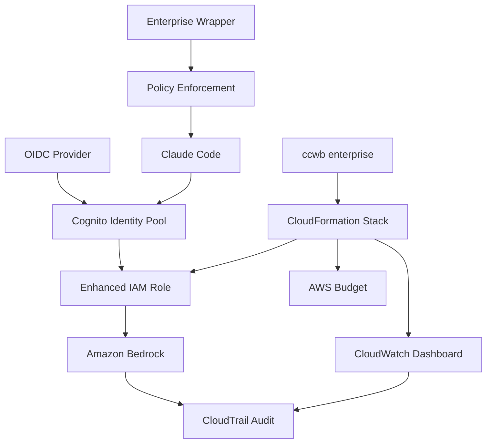

# Enterprise Add-ons for Claude Code with Amazon Bedrock

This directory contains enterprise governance, monitoring, and workflow enhancements for the base Claude Code with Bedrock solution.

## Overview

The enterprise add-ons provide additional capabilities for organizations that need:

- **Enhanced Security**: Fine-grained permission policies and security profiles
- **Cost Management**: Budgets, alerts, and chargeback reporting
- **Governance & Compliance**: Audit trails, policy enforcement, and monitoring
- **Workflow Automation**: Structured workflows with replay and caching

## Directory Structure

```
enterprise-addons/
├── governance/                  # Security and policy management
│   ├── policies/               # Security profile definitions
│   │   ├── base-restrictions.json
│   │   ├── plan-only-profile.json
│   │   ├── restricted-profile.json
│   │   ├── standard-profile.json
│   │   └── elevated-profile.json
│   ├── templates/              # CloudFormation templates
│   │   └── enhanced-cognito-policies.yaml
│   ├── claude-code-wrapper.py  # Enterprise wrapper script
│   └── install-wrapper.sh      # Wrapper installation script
├── observability/              # Enhanced monitoring (planned)
│   ├── dashboards/            # CloudWatch dashboard templates
│   └── collectors/            # OTEL collector enhancements
├── workflows/                  # Workflow automation (planned)
│   ├── templates/             # Workflow YAML templates
│   └── runners/               # Workflow execution engines
└── docs/                      # Enterprise documentation
    └── ENTERPRISE_GOVERNANCE.md
```

## Quick Start

### 1. Prerequisites

Ensure you have deployed the base Claude Code with Bedrock infrastructure:

```bash
cd source
poetry install
poetry run ccwb init
poetry run ccwb deploy
```

### 2. Configure Enterprise Governance

```bash
# Interactive configuration
poetry run ccwb enterprise configure

# Deploy enhanced policies
poetry run ccwb enterprise deploy-policies
```

### 3. Install Enterprise Wrapper (Optional)

For additional client-side controls:

```bash
cd enterprise-addons/governance
sudo ./install-wrapper.sh
```

## Security Profiles

| Profile | Use Case | Key Restrictions |
|---------|----------|------------------|
| **plan-only** | Compliance-heavy orgs | Plan mode only, no execution |
| **restricted** | Development teams | Safe tools only, limited network |
| **standard** | Most enterprises | Balanced security and functionality |
| **elevated** | Platform teams | Advanced permissions, infrastructure access |

## Features

### ✅ Implemented (Epic 0)

- **Security Profiles**: Four pre-configured security levels
- **Policy Templates**: IAM policies with tool restrictions  
- **CLI Extension**: `ccwb enterprise` command suite
- **Enterprise Wrapper**: Client-side policy enforcement
- **Cost Tracking**: Budget and alarm configuration
- **Documentation**: Complete governance guide

### 🔄 Planned (Future Epics)

- **Advanced Observability**: Enhanced OTEL spans and dashboards
- **Workflow Orchestration**: YAML-based automation workflows
- **Chargeback Reporting**: Automated cost attribution reports
- **Compliance Tools**: Audit reporting and policy validation

## Integration with Base Solution

The enterprise add-ons are designed to enhance, not replace, the existing solution:

- **Non-Disruptive**: Base functionality continues unchanged
- **Layered Security**: Additional controls without breaking existing flows
- **Backward Compatible**: Existing deployments work without modification
- **Incremental Adoption**: Deploy features as needed

## Architecture



## Commands

### Enterprise CLI Commands

```bash
# Configuration and deployment
ccwb enterprise configure              # Interactive policy configuration
ccwb enterprise deploy-policies        # Deploy enhanced IAM policies
ccwb enterprise status                 # Show current configuration
ccwb enterprise audit                  # Generate compliance report

# Options
--security-profile=<profile>           # Override security profile
--dry-run                             # Show deployment plan
--force                               # Skip confirmation prompts
```

### Enterprise Wrapper Commands

```bash
# Direct usage
claude-enterprise                      # Use default profile
claude-enterprise --security-profile=restricted
claude-enterprise --check-policy      # Validate compliance

# Profile shortcuts (after installation)
claude-plan                           # Plan-only mode
claude-restricted                     # Restricted development  
claude-standard                       # Standard enterprise
claude-elevated                       # Advanced permissions
```

## Configuration Files

- **`enterprise-config.json`**: Main enterprise configuration
- **`~/.claude-code/enterprise-config.json`**: User-level overrides
- **`/etc/claude-code/enterprise-config.json`**: System-level configuration

## Monitoring

- **CloudWatch Dashboards**: Usage metrics by security profile
- **AWS Budgets**: Cost tracking with configurable alerts
- **CloudTrail**: Complete audit trail of all Bedrock API calls
- **Custom Metrics**: Policy compliance and user attribution

## Support

For issues and questions:

1. Check the [Enterprise Governance Guide](../docs/ENTERPRISE_GOVERNANCE.md)
2. Review CloudWatch dashboards for operational metrics
3. Examine CloudTrail logs for audit information
4. Use `ccwb enterprise status` to verify configuration

## Contributing

When adding new features:

1. Follow the existing directory structure
2. Update this README with new capabilities
3. Add appropriate tests and documentation
4. Ensure backward compatibility with base solution

## License

Same as base project - MIT License